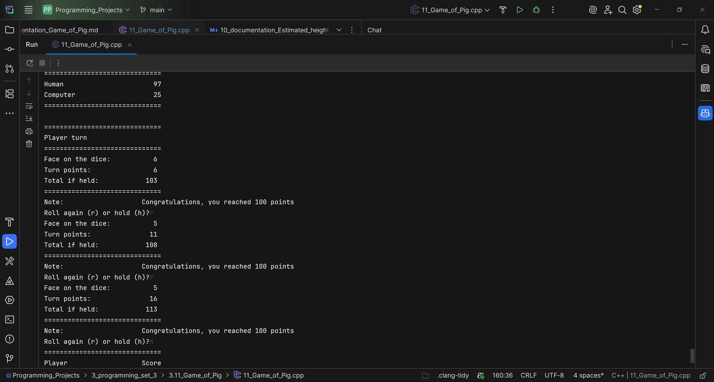

The game of Pig is a simple two player dice game in which the first player to
reach 100 or more points wins. Players take turns. On each turn a player rolls a
six-sided die:
• If the player rolls a 2–6 then he or she can either
— ROLL AGAIN or
— HOLD. At this point the sum of all rolls made this turn is added to the
player’s total score and it becomes the other player’s turn.
• If the player rolls a 1 then the player loses his or her turn. The player gets no
new points and it becomes the opponent’s turn.
If a player reaches 100 or more points after holding then the player wins.
Write a program that plays the game of Pig, where one player is a human and the
other is the computer. Allow the human to input “r” to roll again or “h” to hold.
The computer program should play according to the following rule: keep rolling
on the computer’s turn until it has accumulated 20 or more points, then hold. Of
course, if the computer wins or rolls a 1 then the turn ends immediately. Allow the
human to roll first.
Write your program using at least two functions:
int humanTurn(int humanTotalScore);
int computerTurn(int computerTotalScore);
These functions should perform the necessary logic to handle a single turn for
either the computer or the human. The input parameter is the total score for the
human or computer. The functions should return the turn total to be added to the
total score upon completion of the turn. For example, if the human rolls a 3 and 6
and then holds, then humanTurn should return 9. However, if the human rolls a 3
and 6 and then a 1, then the function should return 0.

---

## Program flow
1. Program seeds the pseudo-random generator using `srand(time(nullptr))`.
2. A loop alternates between the human's turn and the computer's turn until one reaches `GOAL`.
3. After each turn the current scores are displayed.

## Key components (brief)
- `constexpr int GOAL`  
  Target score to win (100).

- `main()`  
  Orchestrates the game loop, prints headers and the inline formatted score display. Uses `setw`/`left`/`right` from `<iomanip>` to align console output.

- `int humanTurn(int humanTotalScore)`  
  Simulates one human turn:
    - Rolls a 6-sided die (`rand() % 6 + 1`) repeatedly.
    - If roll is `1`, the turn ends with `0` points.
    - Otherwise adds roll to `turnPoints`, displays `Turn points` and `Total if held`.
    - Prompts the player to choose `r` (roll again) or `h` (hold). Input is read and validated; when holding the function returns the accumulated `turnPoints`.

- `int computerTurn(int computerTotalScore)`  
  Simulates one computer turn using the simple strategy:
    - Keep rolling until the turn total is at least 20 or reaching `GOAL`.
    - If a `1` is rolled, the computer scores `0` for the turn.
    - Returns the turn total when it holds or on `1`.

- `void printDivider()` and `void printScores(int humanScore, int computerScore)`  
  Small helpers to print consistent separators and the aligned score table.

## Input validation
- The human prompt accepts `r` or `R` to roll again and `h` or `H` to hold.
- Invalid entries produce an error message and re-prompt.

## Output formatting
- Uses `<iomanip>` (`setw`, `left`, `right`) to align labels and numeric values.
- Divider lines use `string(n, '=')` for visual separation.

## Image
Illustration:  

