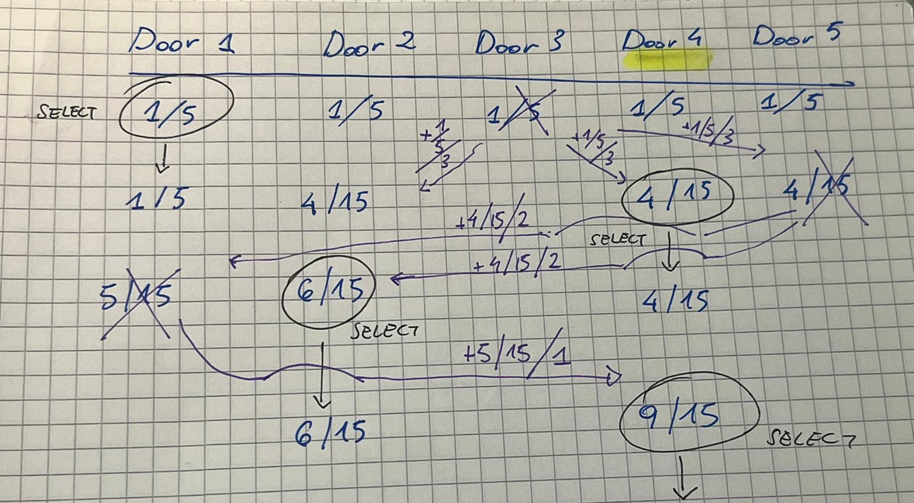

# Monty Hall Problem Simulation

You are a contestant on a game show and have won a shot at the grand prize.
Before you are three doors. $1,000,000 in cash has randomly been placed behind
one door. Behind the other two doors are the consolation prizes of dishwasher detergent.
The game show host asks you to select a door, and you randomly pick one.
However, before revealing the prize behind your door, the game show host reveals
one of the other doors that contains a consolation prize. At this point, the game
show host asks if you would like to stick with your original choice or to switch to
the remaining door.
Write a function to simulate the game show problem. Your function should randomly
select locations for the prizes, select a door at random chosen by the contestant,
and then determine whether the contestant would win or lose by sticking with
the original choice or switching to the remaining door. You may wish to create
additional functions invoked by this function.

Next, modify your program so that it simulates playing 10,000 games. Count the
number of times the contestant wins when switching versus staying. If you are
the contestant, what choice should you make to optimize your chances of winning
the cash, or does it not matter?

---

## Figures

<p align="center">
  
  
</p>


- My draw shows a manual probability decomposition: it enumerates cases and shows how probabilities shift when the host opens doors. 
  That is a Bayes-style tree counting approach: each initial pick has probability 1/5, 
  and conditioned on the host\`s allowed reveals, the remaining unopened door(s) get redistributed probabilities.

- The program screenshot shows a single-run (one game) console trace and final percentages computed from a run for 5 doors game. 
  Small-sample output can be extreme (0\% vs 100\%) because one run is not representative.
- For 10,000 runs ((`GAMES = 10000`)) and 100 doors (`DOORS = 100`) the results for Switching converges to about 60\% wins.
  The picture below illustrates:

<p align="center">
  
</p>

## Overview
This program simulates a generalized Monty Hall problem (here with 5 doors, but it can be changed to any # of doors). 
One door hides the grand prize; the contestant picks a door at random; the host then opens some losing doors 
(never revealing the prize and never opening the contestant\`s chosen door). 
The program can simulate many games and report win rates for two strategies:
- keep the initial pick,
- switch to the remaining unopened door (the usual Monty switch).

For the common host rule "open all but one other door", the theoretical result is: switching wins with probability (n-1)/n. For n = 5 this is 4/5 = 80\%.

## How the code is organized (functions)
- `place_prize(...)`  
  Randomly place the prize behind one of the n doors.

- `contestant_pick(...)`  
  Randomly select the contestant\`s initial door.

- `host_reveal(...)`  
  Given the prize location and the contestant\`s current pick, choose which doors the host opens. The host never opens the prize door and never opens the contestant\`s chosen door. The number of doors opened depends on the variant (for the "leave one other door" variant the host opens n-2 doors).

- `switch_choice(...)`  
  When switching, pick the single remaining unopened door (if the host left exactly one other) or implement the chosen switching rule (e.g., pick uniformly at random among remaining unopened doors if the variant allows).

- `simulate_once(...)`  
  Run the steps above once and return whether keep/switch would win.

- `simulate_many(...)`  
  Repeat `simulate_once(...)` many times (e.g., 10,000) and accumulate statistics to estimate empirical win rates.

## Why `size_t` is used
- Door indices and container sizes are non-negative integers. 
  `size_t` is the standard unsigned integer type used for sizes and indices returned by `vector::size()` and other container operations.
- Using `size_t` avoids signed/unsigned conversion warnings and clearly signals that a value is an index/size (not a potentially negative integer).
- It follows conventional standard for indexing standard containers.

## Randomness: `std::random_device` / `std::mt19937` / distributions
- The program use the `<random>` header with a fixed engine (e.g., `std::mt19937`) and an appropriate distribution 
  (`std::uniform_int_distribution<std::size_t>`) to pick random indices.
- It is used the seed `mt19937` from `std::random_device` for unpredictability
- Using `std::uniform_int_distribution` ensures unbiased uniform draws among door indices.


## Practical note / conclusion
- This program implementation is a variant of the original game. 
- In here, only one door is revealed at a time.
- 2 are the alternatives: Whether the host leaves exactly one other door or leaves multiple unopened doors and the contestant then picks among them. 
- The canonical Monty Hall switch (when host opens n-2 doors leaving exactly one other) gives switching probability (n-1)/n.
- To empirically verify, run the program by changing the constants `DOORS` and `GAMES` with, say, 10\,000 or 100\,000 trials and compare "keep" vs "switch". 
- Results will converge to win rate of ~60% as above.


```cpp
constexpr int DOORS = 5;        // <-- Change here # of doors. Original: 3

constexpr int GAMES = 1;        // <-- Change here # of games to simulate. Original: 10000
```

- Do not forget to comment out `showResults(leftDoorsProbs, selectedDoor);` 
  and `cout << "Winning door: " << winningDoor << "\n";` in main to avoid cluttering the console output.

```cpp
        // ... previous code in main
        
        cout << "Winning door: " << winningDoor << "\n";    // <-- comment out to avoid cluttering output
        
        const int initialChoice = initialPick(selectedDoor);

        // showResults(leftDoorsProbs, selectedDoor);   // <--- comment out to avoid cluttering output

        size_t doorsLeft = leftDoorsProbs.size();
        while (doorsLeft > 2) {
            removeLosingDoor(leftDoorsProbs, winningDoor, selectedDoor);
            nextPick(leftDoorsProbs, selectedDoor);
            --doorsLeft;
            // showResults(leftDoorsProbs, selectedDoor);   // <--- comment out to avoid cluttering output
        }
        if (initialChoice == winningDoor)
            ++winsStaying;
        if (selectedDoor == winningDoor)
            ++winsSwitch;
        ++nGames;
    }
    showStatistics(winsStaying, winsSwitch);
```

## References
[Math.stackexchange: Monty Hall problem with more than 3 doors](https://math.stackexchange.com/questions/1032661/monty-hall-problem-with-five-doors)

