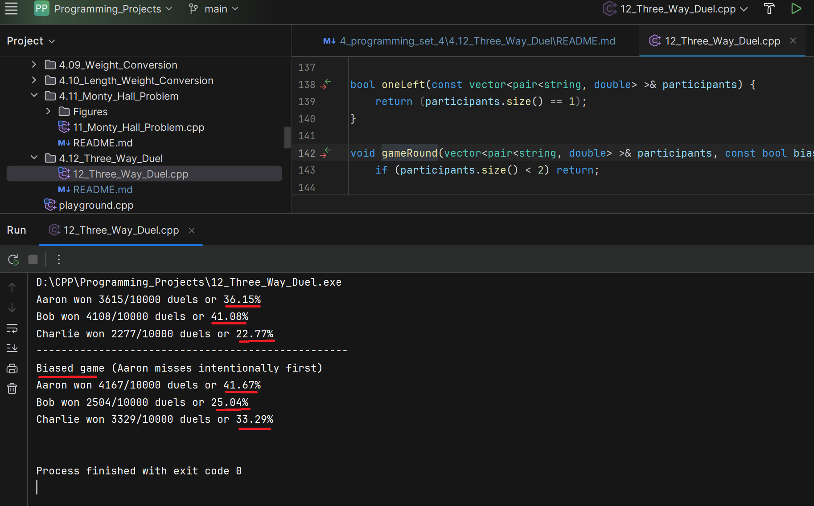

# Three-Way Duel Simulation and Analysis

In the land of Puzzlevania, Aaron, Bob, and Charlie had an argument over which
one of them was the greatest puzzle-solver of all time. To end the argument once
and for all, they agreed on a duel to the death. Aaron was a poor shot and only hit
his target with a probability of 1/3. Bob was a bit better and hit his target with a
probability of 1/2. Charlie was an expert marksman and never missed. A hit means
a kill and the person hit drops out of the duel.
To compensate for the inequities in their marksmanship skills, the three decided
that they would fire in turns, starting with Aaron, followed by Bob, and then by
Charlie. The cycle would repeat until there was one man standing. That man
would be remembered for all time as the Greatest Puzzle-Solver of All Time.
An obvious and reasonable strategy is for each man to shoot at the most accurate
shooter still alive, on the grounds that this shooter is the deadliest and has the best
chance of hitting back.
Write a program to simulate the duel using this strategy. Your program should use
random numbers and the probabilities given in the problem to determine whether
a shooter hits his target. You will likely want to create multiple subroutines and
functions to complete the problem. Once you can simulate a duel, add a loop to
your program that simulates 10,000 duels. Count the number of times that each
contestant wins and print the probability of winning for each contestant (e.g., for
Aaron your program might output “Aaron won 3595/10,000 duels or 35.95%”).
An alternate strategy is for Aaron to intentionally miss on his first shot. Modify the
program to accommodate this new strategy and output the probability of winning
for each contestant. What strategy is better for Aaron, to intentionally miss on the
first shot or to try and hit the best shooter?

---


# Mathematical Explanation of the Game Theory of Three-Way Duel

## 0. Setup

To increase their chances of surviving, the duellists prefer to be left with a weaker opponent. 
So Bob would not shoot at Aaron in preference to Charlie, and Charlie will not shoot at Aaron in preference to Bob. 
Thus, Aaron will not be shot at until Bob or Charlie is dead, and Aaron will either be left standing 
with Bob or Charlie, with or without the shot. 
This puts Aaron in a privileged position, because he can decide whether shooting at Charlie or missing,
until Charlie or Bob are shot dead.

Turn order repeats **A → B → C.**  
Everyone always aims at the most accurate opponent still alive.

| Shooter       | Accuracy     |
|---------------|--------------|
| Aaron (A)     | pₐ = 1/3     |
| Bob (B)       | pᵦ = 1/2     |
| Charlie (C)   | p꜀ = 1       |


## 1. Two-person duel when Charlie is gone

Since the three-way-duel will end inevitably to two-people duel, 
it is convenient to compute the probability of winning of one contestant in a two-duel match.

| Situation | Who fires first | Aaron’s win probability |
|------------|----------------|--------------------------|
| A vs B | **Aaron** fires first | P₍AB₎ᵃ = (1/3) / [1 − (2/3)·(1/2)] = 1/2 |
| A vs B | **Bob** fires first   | P₍AB₎ᵇ = (1 − pᵦ)·P₍AB₎ᵃ = (1/2)·(1/2) = 1/4 |
| A vs C | **Aaron** fires first | P₍AC₎ = pₐ = 1/3 |

- For Aaron, the probability of winning against Bob P₍AB₎ᵃ can be interpreted in this way:
  1/3 of the time he will shoot and kill Bob immediately.  
  2/3 of the time he will miss, and then Bob will miss the shot half of the time,
  returning to the initial situation (Aaron shooting first), which is P₍AB₎ᵃ.
  In other words, P₍AB₎ᵃ = (1/3) + (2/3)·(1/2)·P₍AB₎ᵃ, which is the same of the first row above.
- Similarly, when Bob shoots first, Aaron can only win if Bob misses (pᵦ = 1/2),
  and then Aaron wins the duel shooting first (P₍AB₎ᵃ).
  In other words, P₍AB₎ᵇ = (1-pᵦ)·P₍AB₎ᵃ, as above
- If Aaron faces Charlie, he can only win if he hits him immediately (pₐ = 1/3), because after 
  the first miss, Charlie will kill him right away.
  P₍AC₎ = pₐ · (1-0) = 1/3.
- If Charlie shoots first at Aaron, Aaron will lose anytime.

---

## 2. Strategy 1 – Aaron shoots at Charlie first

| Path | Probability of the path | Aaron’s eventual win probability |
|------|--------------------------|----------------------------------|
| (1) A hits C → duel A vs B, **Bob** to fire | pₐ = 1/3 | P₍AB₎ᵇ = 1/4 |
| (2a) A misses, B hits C → duel A vs B, **Aaron** to fire | (1 − pₐ)pᵦ = (2/3)·(1/2) = 1/3 | P₍AB₎ᵃ = 1/2 |
| (2b) A misses, B misses, C kills B → duel A vs C, **Aaron** to fire | (1 − pₐ)(1 − pᵦ) = (2/3)·(1/2) = 1/3 | P₍AC₎ = 1/3 |

For a three-way duel, there are more possible paths to Aaron winning.
A first strategy is for Aaron to start shooting at Charlie immediately.

1. Case 1: Aaron hits Charlie (probability pₐ = 1/3) and is left dueling with Bob in a two-person duel, where 
   Bob shoots next, with probability of Aaron of winning the duel above of P₍AB₎ᵇ = 1/4.  
   Aaron’s chance of winning this duel equals to: pₐ · P₍AB₎ᵇ = (1/3)·(1/4) = 1/12.

2. Case 2a: Aaron misses Charlie (probability 1 − pₐ = 2/3), and then Bob shoots at Charlie 
   and hits him (probability pᵦ = 1/2).
   In this case, Aaron is left dueling with Bob in a two-person duel, where 
   Aaron shoots next, so Aaron fires first in the duel A vs B, with probability of winning above of P₍AB₎ᵃ = 1/2. 
   Aaron’s chance of winning this duel in this case equals to: (1 − pₐ)· pᵦ· P₍AB₎ᵃ = (2/3)·(1/2)·(1/2) = 1/6

3. Case 2b: Aaron misses Charlie (probability 1 − pₐ = 2/3), and then Bob shoots at Charlie 
   and misses him (probability 1 − pᵦ = 1/2). 
   Now Charlie shoots at Bob and kills him (probability 1).
   In this case, Aaron is left dueling with Charlie in a two-person duel, where 
   Aaron shoots next, with probability of winning above of P₍AC₎ = 1/3.
   Aaron’s chance of winning this duel in this case equals to: (1 − pₐ)·(1 − pᵦ)· P₍AC₎ = (2/3)·(1/2)·(1/3) = 1/9

Adding the probabilities, we have:
```
Pₐ (Aaron doesn't miss) =
= [ pₐ · P₍AB₎ᵇ ] + [ (1 − pₐ)· pᵦ· P₍AB₎ᵃ ] + [ (1 − pₐ)(1 − pᵦ)· P₍AC₎ ] =
= [ (1/3)·(1/4) ] + [ (2/3)·(1/2)·(1/2) ] + [ (2/3)·(1/2)·(1/3) ] =
= 1/12 + 1/6 + 1/9 =
= 3/36 + 6/36 + 4/36 =
= 13/36 ≈ 0.3611 =
= 36.11%.
```

The empirical result (figure below) of **36.15%** matches the analytical result of **36.11%**.

---

## 3. Strategy 2 – Aaron intentionally misses his first shot

A second strategy for Aaron is that of intentionally missing the target on his first shot.
In other words, Aaron will wait for Bob and Charlie to shoot at each other first, 
then Aaron will start shooting at the most accurate opponent still alive.

| Branch | Path probability | Resulting duel | Aaron’s chance in that duel |
|---------|------------------|----------------|------------------------------|
| B hits C | pᵦ = 1/2 | A vs B, **Aaron** to fire | P₍AB₎ᵃ = 1/2 |
| B misses C | (1 − pᵦ) = 1/2 | C kills B → A vs C, **Aaron** to fire | P₍AC₎ = 1/3 |

1. Case 1: Bob shoots at Charlie and hits him (probability pᵦ = 1/2).  
   Now Aaron is left dueling with Bob in a two-person duel, where Aaron shoots next, 
   with probability of winning above of P₍AB₎ᵃ = 1/2.  
   Aaron’s chance of winning this duel in this case equals to: pᵦ· P₍AB₎ᵃ = (1/2)·(1/2) = 1/4.

2. Case 2: Bob shoots at Charlie and misses him (probability 1 − pᵦ = 1/2).  
   Now Charlie shoots at Bob and kills him (probability 1).  
   Aaron is left dueling with Charlie in a two-person duel, where Aaron shoots next, 
   with probability of winning above of P₍AC₎ = 1/3.  
   Aaron’s chance of winning this duel in this case equals to: (1 − pᵦ)· P₍AC₎ = (1/2)·(1/3) = 1/6.

Adding the probabilities, we have:
```
Pₐ (Aaron misses) =
= [ pᵦ· P₍AB₎ᵃ ] + [ (1 − pᵦ)· P₍AC₎ ]
= [ (1/2)·(1/2) ] + [ (1/2)·(1/3) ]
= 1/4 + 1/6
= 3/12 + 2/12
= 5/12 ≈ 0.4167 = 41.67%
```

The empirical results (figure below) (~41.67%) agree perfectly with this theoretical value.

For Aaron, missing his target and waiting for the other two opponents to kill each other 
is better than shooting at Charlie right away (41.67% > 36.11%).

---

## 4. Why Bob will never skip his shot?

If Bob decides not to shoot, Charlie (the perfect `marksman`) kills him immediately.  
Bob’s winning probability drops to **0%**.  
Thus, the equilibrium of the game is:

- Aaron intentionally misses.
- Bob fires at Charlie.
- Charlie fires at Bob.

---

## 5. Theoretical results

| Strategy profile | Aaron | Bob | Charlie |
|------------------|--------|-----|----------|
| **Normal play** – Aaron shoots at Charlie | 13/36 ≈ 36.1% | 5/12 ≈ 41.7% | 2/9 ≈ 22.2% |
| **Aaron misses first** (equilibrium) | 5/12 ≈ 41.7% | 1/4 = 25% | 1/3 ≈ 33.3% |


## 6. Empirical results

| Strategy profile | Aaron  | Bob    | Charlie |
|------------------|--------|--------|---------|
| **Normal play** – Aaron shoots at Charlie | 36.15% | 41.08% | 22.77%  |
| **Aaron misses first** (equilibrium) | 41.67% | 25.04% | 33.29%  |

- 10,000 runs
- Turn order: A → B → C
- Everyone shoots at the most accurate survivor

<p align="center">
  
</p>

---

## 6. Final Observation

For Aaron, intentionally missing on his first shot is unequivocally better.

**41.7% chance of winning** versus **36.1%** if he tries to hit Charlie right away.

The empirical results for **10,000 duels** match these exact values,  
so the analysis and code are both correct.


---

Added a short "Implementation notes & function comments" fragment suitable to paste into `README.md` after section 6. Final Observation.

## 7. Implementation notes \& function comments

### Constants and RNG (i.e. Random number generator)
  - `AARON_SKILLS`, `BOB_SKILLS`, `CHARLIE_SKILLS` — shooter accuracies (`1/3`, `1/2`, `1`).
  - `GAMES` — number of simulated duels (10,000).
  - `std::random_device rd; std::mt19937 rng(rd());` — non-deterministic seed used for simulation. 
     For reproducible unit tests replace `rd()` with a fixed seed (e.g., `std::mt19937 rng(12345);`).

- `main()`
  - Sets floating output formatting.
  - Runs two experiments:
    1. Normal play (Aaron fires normally).
    2. Biased play (Aaron intentionally misses his first opportunity).
  - For each game it calls `gameStart`, then loops `gameRound` until one winner remains, and finally accumulates results with `addStats`.
  - Prints results with `showStats`.

- `gameStart(vector<pair<string,double>>& participants)`
  - Resets and populates the `participants` vector with `("Aaron", p)`, `("Bob", p)`, `("Charlie", p)`.
  - Calls `orderShoot` so shooters are ordered by ascending accuracy (so the firing cycle is lowest-accuracy first).

- `orderShoot(vector<pair<string,double>>& participants)`
  - Reorders `participants` so that the least accurate shooter is first and the most accurate is last.
  - The current implementation uses a simple selection-like loop. It can be replaced by `std::sort` with a comparator on `.second` (see below).

- `oneLeft(const vector<pair<string,double>>& participants)`
  - Returns true when only one participant remains (the winner).

- `gameRound(vector<pair<string,double>>& participants, bool bias)`
  - Simulates a single pass through the current alive shooters.
  - `bias == true` starts the round with the second shooter (Aaron intentionally misses) so Aaron effectively skips his first shot until someone dies.
  - For each shooter in turn:
    - Draws a Bernoulli trial using the shooter's accuracy.
    - If the shooter hits, they always target the most accurate opponent still alive (the element at the end of the `participants` vector). If the shooter is the most accurate, they target the second-most accurate.
    - Removing a target may shift indices; the function adjusts the current shooter index when necessary.
    - If `bias` was set and a kill occurs, the function returns immediately so Aaron's deliberate miss behavior is enforced until a death happens.
  - Assumes `participants` is ordered by accuracy before the call.

- `addStats(const vector<pair<string,double>>& participants, vector<pair<string,int>>& winStats)`
  - The remaining `participants.front()` is the winner; increment that player's counter in `winStats` or add a new entry if first seen.

- `showStats(const vector<pair<string,int>>& winStats, bool bias)`
  - Prints the aggregated win counts and percentages (uses `GAMES` for normalization).
  - Sorts printed output by player name to keep results stable and readable.
  - When `bias == true` prints a separator and a header indicating the biased experiment.

- `eraseStats(vector<pair<string,int>>& vectorPlayers)`
  - Resets the stats vector to empty.

### Notes 
- The algorithm relies on ordering `participants` by accuracy, but could use `sort` from `algorithm` library 
- For deterministic tests, we use a fixed RNG seed; for real runs we use the `std::random_device` seed like in the code
- The `gameRound` index adjustments are critical — removing an element before the current shooter reduces the current index by 1
- It is also critical the line below in function `gameRound`, to allow Aaron start playing in the biased version

```cpp
void gameRound(vector<pair<string, double> >& participants, const bool bias) {
   
   // other code..
   
   if (bias)       // if Aaron doesn't shoot at first (bias),
      return;      // he starts when one participant dies
```


## 8. Alternative ways to the problem

### 8.1 Ordering
function `orderShoot` can also be rewritten more efficiently by using `algorithm` 
from std library. 

```cpp
void orderShoot(vector<pair<string, double> >& participants) {
    std::sort(participants.begin(),
                  participants.end(),
                  [](const pair<string, double>& a,
                     const pair<string, double>& b) {
                      return a.second < b.second;   // ascending by skill
                  });
}
```

### 8.2 gameRound with for loop
one could also write the function `gameRound` with a for loop, even though the while is clearer here.

```cpp
void gameRound(vector<pair<string, double> >& participants) {
    if (participants.size() < 2) return;

    for (size_t idx = 0; idx < participants.size(); ++idx) {
        bernoulli_distribution hit(participants[nPlayer].second);
        if (!hit(rng)) 
            // missed shot
            continue;

        // Players shoot in order of skills (ascending).
        // Kill the most lethal (last) then second to last, etc.
        const size_t mostLethal = participants.size() - 1;
        const size_t target = (nPlayer == mostLethal) ? nPlayer - 1 : mostLethal;

        // most lethal is shot
        participants.erase(participants.begin() + target);

        // if we removed element before current shooter,
        // current shooter's index decreased by 1
        if (target < nPlayer) --nPlayer;

        if (participants.size() < 2) break;
    }
}
```

### References
[Math StackExchange: Three-way duel probabilities](https://math.stackexchange.com/questions/687272/a-three-way-duel-probability-puzzle)