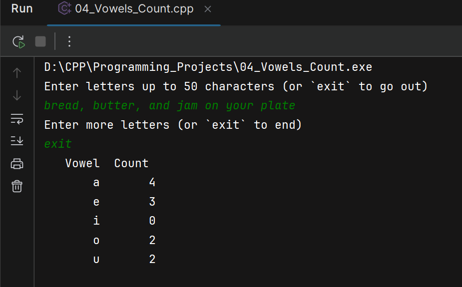

Write a program that reads in an array of characters. You may assume that there
are fewer than 50 entries in the array. Your program determines how many entries
are used. The output is to be a two-column list. The first column is a list of vowels
in the English alphabet; the second column is the count of the number of occurrences
of each vowel. The list should be sorted on entries in the first column in
alphabetical order.
For the array values
b r e a d , b u t t e r, a n d j a m o n y o u r p l a t e
the output should be
Vowel Count
a 4
e 3
i 0
o 2
u 2

---

## Illustrative example
<p align="center">
  
</p>

# Description
- Program reads up to 50 characters, counts occurrences of the five English vowels (`a`, `e`, `i`, `o`, `u`) and prints a two‑column table: Vowel / Count.
- Example output for input `b r e a d , b u t t e r, a n d j a m o n y o u r p l a t e`:
  ```
  Vowel   Count
  a       4
  e       3
  i       0
  o       2
  u       2
  ```

## Key constants
- `SIZE = 50` — max characters stored.
- `N_VOWELS = 5` — number of vowels.
- `VOWELS[] = {'a','e','i','o','u'}` — vowel list (lowercase).

## Main flow (in `main`)
- Allocate `text` array and `vowelsCount` (zero-initialized with `= {}`).
- Call `fillUpText` to read input and set `lettersUsed`.
- Call `countVowels` to tally vowel occurrences into `vowelsCount`.
- Call `smartPrint` to print the formatted table.

## Functions
- `void fillUpText(char text[], int size, int& lettersUsed)`
    - Reads lines with `std::getline`.
    - Iterates characters in each line and appends only alphabetic characters (`std::isalpha`) to `text` until `size` or the user types `exit`.
    - Sets `lettersUsed` to number of stored letters.
- `void countVowels(const char text[], int size, int lettersUsed, int vowels[], int sizeVowels)`
    - Iterates the stored letters; for each letter calls `foundLetter` to see if it is a vowel and increments the corresponding counter.
- `bool foundLetter(char letter, int& idxVowel)`
    - Linear search of `VOWELS` array; if match found returns `true` and sets `idxVowel` to the vowel index.
- `void smartPrint(const int vowelsCount[], int size)`
    - Prints headers and each vowel with its count using `std::setw` for alignment.

## Implementation notes
- Input handling: program uses `std::getline` and `std::isalpha` so punctuation (commas, spaces) is ignored and only letters are stored. If the program instead used `operator>>` tokens, commas could attach to tokens and cause validation problems.
- Case sensitivity: `VOWELS` contains lowercase letters. 
  Convert input letters to lowercase (e.g. `std::tolower`) when finding vowels in `countVowels`.
  ```cpp void countVowels(...) {
      ...
      char lowerCh = static_cast<char>(std::tolower(text[idx]));
        if (foundLetter(lowerCh, vowelLetter))
            vowels[vowelLetter] += 1;
   ```
- `lettersUsed` returns how many letters were stored; only `text[0]` through `text[lettersUsed-1]` are valid.


## Alternative implementation
One could use a `std::map<char,int>` to map vowels to counts, simplifying `foundLetter` and `countVowels`. 
However, this would introduce dynamic memory allocation and complexity beyond the scope of this exercise. 
The current fixed-size array approach is straightforward and efficient for the known set of vowels.

In addition, one could ignore numbers and puntuate by using `std::isalpha` to filter input characters, ensuring only letters are counted.
In particular, function `fillUpText` could be modified to only store alphabetic characters:
```cpp
void fillUpText(char text[], int size, int& lettersUsed) {
    ...
    for (char ch : line) {
        if (std::isalpha(static_cast<unsigned char>(ch))) {
            text[lettersUsed++] = ch;
            if (lettersUsed >= size) break;
        }
    }
    ...
}
```
