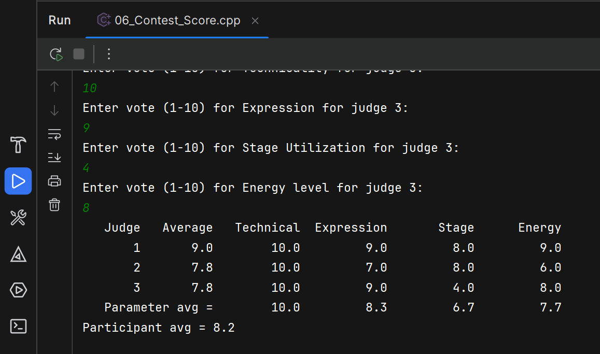

On a popular television dance show, each contestant is given scores based on 4
parameters: technicality, expression, stage utilization, and the energy level of the
contestant. The jury of 3 judges award scores of 1 to 10 against each parameter, with
10 being the highest. All the scores given by a judge are summed up and averaged
against the scores given by the other judges to obtain each contestant’s final score.
Write a computer program that inputs scores given by each judge against all the
parameters and calculates the overall score obtained by a contestant. The program
should ensure that all inputs are within the allowable data ranges.

---

## Illustrative example

  

## Overview
This program computes the overall score for a contestant on a dance show. 
There are `JUDGES = 3` judges and `PARAMETERS = 4` scoring categories:

- Technicality
- Expression
- Stage Utilization
- Energy level

Each judge provides a score `1..10` for each parameter. The program validates inputs, 
computes per-judge averages, per-parameter averages, and a final participant average computed 
from the judges' averages. Results are displayed in a formatted table.

## Run
- Prompts: `Enter vote (1-10) for <Parameter> for judge <n>:`
- Inputs must be numeric and within `1` to `10`. Non-numeric or out-of-range entries will be rejected and the user is asked to retry.

## High-level design
- Fixed-size C-style 2D array `double score[JUDGES][PARAMETERS]` holds all scores.
- Constants `JUDGES` and `PARAMETERS` are `constexpr`.
- `NAME_PARAMETERS` is a `std::array<std::string, PARAMETERS>` for display labels.

Processing pipeline:
1. `fillData` — read and validate input into `score`.
2. `computeJudgeAvg` — compute average score for each judge (average of the judge's parameter scores).
3. `computeParameterAvg` — compute average for each parameter across judges.
4. `computeParticipantAvg` — average of the judges' averages (final contestant score).
5. `displayResults` — print a formatted table with per-judge averages, individual scores, parameter averages, and participant average.

## Function reference 
- `void fillData(double score[][PARAMETERS], int nJudges)`
  - Reads scores. Validates numeric input and range `1..10`. Uses `std::cin.clear()` and `std::cin.ignore()` to recover from invalid input.

- `void computeJudgeAvg(const double score[][PARAMETERS], int nJudges, double judgeAvg[], int numJudges)`
  - Computes each judge's average as `sum of that judge's parameter scores / PARAMETERS`.

- `void computeParameterAvg(const double score[][PARAMETERS], int nJudges, double parameterAvg[], int nParameters)`
  - Computes each parameter's average across all judges as `sum / nJudges`.

- `double computeParticipantAvg(const double judgeAvg[], int nJudges)`
  - Returns the average of the `judgeAvg` array.

- `void displayResults(const double score[][PARAMETERS], int nJudges, const double judgeAvg[], int numJudges, const double parameterAvg[], int numParameters, double participantAvg)`
  - Prints a neatly formatted table using `std::setw`, `std::fixed`, and `std::setprecision(1)`.

## Data validation and safety notes
- Inputs are asserted to be within `1..10` after reading when compiled with assertions enabled. Remove or define `NDEBUG` to disable asserts.
- The program uses fixed-size arrays. Ensure `JUDGES` and `PARAMETERS` constants match intended configuration.
- Function signatures include redundant size parameters in the provided file; these are used consistently 
  by the program but can be simplified, but are left for practice purposes.

## Example interaction 
User enters numbers as prompted. After input, output looks like:
- Header row: `Judge | Average | Technical | Expression | Stage | Energy`

## Notes 
- You may simplify function signatures by removing duplicate numeric parameters that duplicate compile-time constants.
- Keep input validation in `fillData` to avoid invalid program state.

