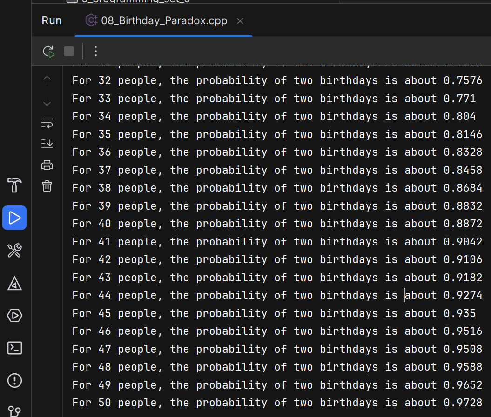

The birthday paradox is that there is a surprisingly high probability that two people
in the same room happen to share the same birthday. By birthday, we mean the same
day of the year (ignoring leap years), but not the exact birthday including the birth
year or time of day. Write a program that approximates the probability that two
people in the same room have the same birthday, for 2 to 50 people in the room.
The program should use simulation to approximate the answer. Over many trials
(say, 5000), randomly assign birthdays to everyone in the room. Count up the
number of times at least two people have the same birthday, and then divide by
the number of trials to get an estimated probability that two people share the same
birthday for a given room size.
Your output should look something like the following. It will not be exactly the
same due to the random numbers:
For 2 people, the probability of two birthdays is about 0.002
For 3 people, the probability of two birthdays is about 0.0082
For 4 people, the probability of two birthdays is about 0.0163
. . .
For 49 people, the probability of two birthdays is about 0.9654
For 50 people, the probability of two birthdays is about 0.969

---

## Example Output:
<p align="center">
  
</p>

# 08 — Birthday Paradox

This program simulates the birthday paradox: for room sizes from 2 to 50 it estimates
the probability that at least two people share the same birthday. It runs many trials
(default 5000). For each trial and each room size the program assigns random months
and days (ignoring leap years) to every person, checks whether any two birthdays
match, and accumulates counts which are later converted into probabilities.

## How it works:
- `main` loops over trials and room sizes. For each room size it fills a `Birthday`
  array with random dates and tests for duplicates.
- `randomBirthday` assigns a random month (1..12) and a valid day for that month
  using a single static `std::mt19937` RNG (so the generator is not reseeded each call).
- `isSameBirthday` checks pairwise for equal `Birthday` values and returns true on
  the first match.
- `showResults` prints the observed probability (matches / trials) for room sizes 2..50.

## Design notes:
- The program re-uses `Birthday people[MAX_PEOPLE] = {}` to zero-initialize the array before
  filling it; this is safe and clear.
- Using a single static RNG avoids repeatedly seeding and gives good performance.

```cpp
void randomBirthday(Birthday& birthday) {
    // use a single static seed the generator, so don't reseed every call
    static std::mt19937 rng(std::random_device{}());
    ...
```

## About the Operator overloading in structure type: `operator==` for `Birthday`:
The `operator==` compares two `Birthday` objects by comparing their `month` and
`day` members. The implementation in the code uses `std::tie`:

```cpp
bool operator==(const Birthday& other) const {
    return std::tie(month, day) == std::tie(other.month, other.day);
}
```

`std::tie` creates a tuple of references to the members and leverages `std::tuple`'s
`operator==` to perform a member-wise comparison. This is concise and scales well if
you add more fields. An equivalent and slightly more explicit implementation is:

```
bool operator==(const Birthday& other) const {
    return month == other.month && day == other.day;
}
```

The defined `operator==` is `const` because it does not modify either operand. If
you use `std::tie`, remember to include `<tuple>` in the libraries used.

