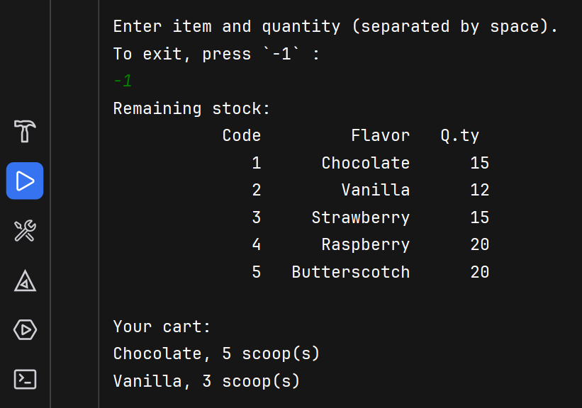

Write a program that displays the list of flavors available at an ice-cream parlor with
a unique code for each flavor, as shown below.
Code Flavor
1 Chocolate
2 Vanilla
3 Strawberry
4 Raspberry
5 Butterscotch
The program then displays the code and quantity available for customers to purchase
as shown below.
1 20
2 15
3 15
4 20
5 20
The program should read the user’s choice of flavors and quantity and display the
products remaining in the stock, until the stock is exhausted or the user signals
that the program should end. Finally, the user’s cart should be displayed as shown
below
Chocolate 3
Strawberry 1
Raspberry 1

---

## Illustrative example:
<p align="center">
  
</p>

# Ice cream parlor
This program models an ice-cream parlor inventory and a simple customer cart.
It displays available flavors with unique numeric codes and their quantities, 
accepts user purchases, updates stock, and finally prints remaining stock and the user's cart.

## Behavior
1. At each step the program shows the current stock (code, flavor, quantity).
2. The user enters a pair: `<code> <quantity>` (separated by space). Enter `-1` alone to exit.
3. Input is validated: codes must be in range, quantity must be > 0 and ≤ available stock.
4. On valid purchase the stock is decreased and the cart (quantities per flavor) is updated.
5. When the user exits (or EOF), the program prints the remaining stock and the cart contents.

## Key functions
1. `makeChoice` — prompts, parses and validates a single user input; on success it adjusts stock and returns a zero-based `choice` and `qtyChosen`. If the user requests exit or EOF, `choice` is set to `-1`.
2. `addChoice` — records `qtyChosen` into the `cart` array at index `choice`.
3. `showOffer` — prints the list of flavors with codes and remaining quantities.
4. `showCart` — prints the non-zero items from the user's cart.
5. `main` — initializes flavors, quantities and cart; loops reading choices; then prints final stock and cart.


Example session (user input shown after `>`):
1. Program shows stock.
2. `> 1 3`  (buys 3 Chocolate)
3. `> 3 1`  (buys 1 Strawberry)
4. `> -1`   (exit)
5. Program prints remaining stock and:
```
Your cart:
Chocolate, 3 scoop(s)
Strawberry, 1 scoop(s)
```

## Tracking remaining and purchased quantities
The code uses parallel arrays and a small protocol to keep cart items 
tied to flavors and to update stock immediately.

- Recording the cart (in `addChoice`)
   - Caller calls `addChoice(cart, nFlavors, choice, qtyChosen)` after a successful selection.
   - `addChoice` simply does `cart[choice] += qtyChosen` (with a bounds check).
   - Because `cart` uses the same index as `flavors` and `quantity`, the flavor ↔ index association is preserved.

### Takeaways
- Storing quantities per flavor index (not just names) preserves the mapping.
- Decrementing `quantity[]` on successful input prevents overselling.
- The sentinel `choice = -1` stops the loop in case of error or exit prompt by the user.

