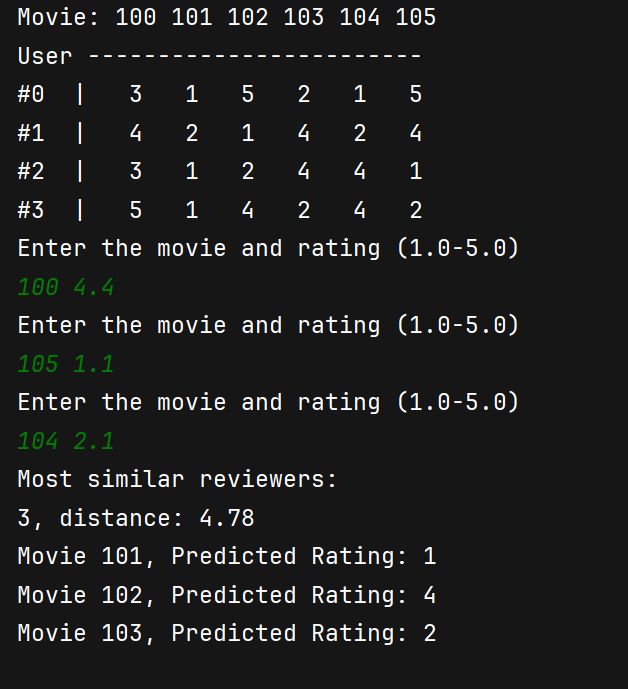

You have collected reviews from four movie reviewers where the reviewers are
numbered 0–3. Each reviewer has rated six movies where the movies are numbered
100–105. The ratings range from 1 (terrible) to 5 (excellent).
The reviews are shown in the following table:

| Reviewer | 100 | 101 | 102 | 103 | 104 | 105 |
|---------:|:---:|:---:|:---:|:---:|:---:|:---:|
| 0        |  3  |  1  |  5  |  2  |  1  |  5  |
| 1        |  4  |  2  |  1  |  4  |  2  |  4  |
| 2        |  3  |  1  |  2  |  4  |  4  |  1  |
| 3        |  5  |  1  |  4  |  2  |  4  |  2  |

Write a program that stores this data using a 2D array. Based on this information
your program should allow the user to enter ratings for any three movies. The program
should then find the reviewer whose ratings most closely match the ratings
input by the user. It should then predict the user’s interest in the other movies by
outputting the ratings by the reviewer for the movies that were not rated by the
user. Use the Cartesian distance as the metric to determine how close the reviewer’s
movie ratings are to the ratings input by the user. This technique is a simple version
of the nearest neighbor classification algorithm.
For example, if the user inputs a rating of 5 for movie 102, 2 for movie 104, and
5 for movie 105, then the closest match is reviewer 0 with a distance of sqrt
((5 - 5)2 + (2 - 1)2 + (5 - 5)2) = 1. The program would then predict a rating of
3 for movie 100, a rating of 1 for movie 101, and a rating of 2 for movie 103.

---

# Illustrative example

  

## Movie Recommendation System - Implementation
This program implements a simple nearest-neighbor movie recommender. 
It stores ratings from 4 reviewers for 6 movies (codes `100`–`105`). 
The user enters ratings for any 3 distinct movies. 
The program finds the reviewer(s) whose ratings are closest to the user's ratings 
(Cartesian / Euclidean distance) and predicts ratings for the remaining movies by averaging 
those reviewers' ratings.

## Data
- Reviewers: `0`..`3`
- Movies: codes `100`..`105` (6 movies)
- Ratings: integers in range `1.0`..`5.0`
- Constants are defined at top of the file: `REVIEWERS`, `MOVIES`, `CHOICES`, `FIRST`, `LAST`, `MIN`, `MAX`.

## Algorithm (high level)
1. Load the fixed reviews matrix (4×6).
2. Ask the user to input 3 distinct movie codes and their ratings.
3. Compute squared Cartesian distance between the user's 3 ratings and each reviewer's corresponding ratings:
   - distance_r = sum\_over\_chosen\_movies (userRating - reviewerRating)\^2
   - squared distances suffice to compare closeness; square root is unnecessary.
4. Find the minimum distance and collect all reviewers with distance within an epsilon of that minimum (ties allowed).
5. For each movie the user did not rate, predict its rating as the average of those similar reviewers' ratings.
6. Print the predicted ratings and the most similar reviewer(s) with distances.

## Important implementation details
- Defensive initialization: arrays such as `choices`, `scoreChoice`, `notSeen`, and `ratingNotSeen` are initialized to avoid undefined behavior.
- `computeDistance` accumulates squared differences per reviewer.
- `findMostSimilar` uses `std::min_element` and an `EPS` value (1e-9) to detect ties robustly.
- If no similar reviewer is found (should not happen with fixed data), the code guards against divide-by-zero and reports the condition.
- Predictions are computed as the arithmetic mean of the similar reviewers' integer ratings (stored as `double`).

## Main functions (responsibilities)
- `fillReviews(...)` — fills the reviews 2D array with the hard-coded table.
- `showReviews(...)` — prints the reviews table (for user reference).
- `makeChoice(...)` — reads 3 distinct movie codes and ratings from the user; validates input.
- `addNotChosen(...)` — builds the list of movie codes the user did not rate.
- `computeDistance(...)` — computes squared Euclidean distances between user choices and each reviewer.
- `findMostSimilar(...)` — finds reviewer indices with the minimal distance.
- `computeRatingFromSimilar(...)` — averages similar reviewers' ratings for each not-seen movie.
- `showSimilar(...)` — prints similar reviewer indices and their distances.
- `showPrediction(...)` — prints predicted ratings for not-seen movies.

## Example
User inputs:
- Movie `102` -> rating `5`
- Movie `104` -> rating `2`
- Movie `105` -> rating `5`

Closest reviewer: `0` (distance = 1). 
Predicted ratings for the other movies are reviewer `0`'s ratings: 
movie `100` -> `3`, movie `101` -> `1`, movie `103` -> `2`.

