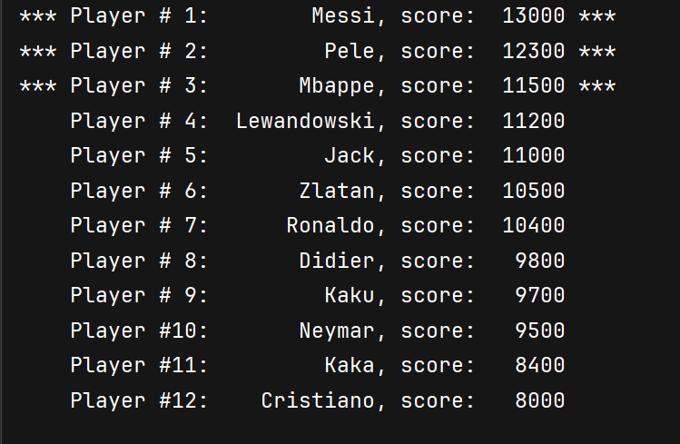

This project is an extension of Programming Project 4.16. Consider a text file
named scores.txt that contains player scores for a game. A possible sample is
shown next where Ronaldo’s best score is 10400, Didier’s best score is 9800, etc.
Put at least five names and scores in the file.
Ronaldo
10400
Didier
9800
Pele
12300
Kaka
8400
Cristiano
8000
Write a function named getHighScores that takes two array parameters, an array
of strings and an array of integers. The function should scan through the file and
set the string array entry at index 0 to the name of the player with the highest score
and set the integer array entry at index 0 to the score of the player with the highest
score. The string array entry at index 1 should be set to the name of the player with
the second highest score and the integer array entry at index 1 should be set to the
score of the player with the second highest score. Do the same for the entries at
index 2. Together, these two arrays give you the names and scores of the top three
players. In your main function, test the getHighScores function by calling it and
outputting the top three players and scores.

---


# Purpose
- Read name/score pairs from the file `./5_programming_set_5/5.18_Highest_Score_Players/Utilities/Scores.txt`.
- Sort players by score in descending order.
- Display the top `BEST` players.

# Illustrative example
<p align="center">
  
</p>

## Key functions and responsibilities
- `main`
    - Allocates arrays `name[MAX]` and `score[MAX]`.
    - Calls `copyData` to fill the arrays, `orderData` to sort them, and `showBest` to print results.

- `copyData`
    - Opens the file (via `openFile`), parses it (`parseFile`) and closes it (`closeFile`).
    - Sets `nPlayers` to the number of entries read.

- `openFile` / `closeFile`
    - Thin wrappers for opening and closing the `std::ifstream`. `openFile` returns `false` on failure so the caller can handle errors.

- `parseFile`
    - Reads lines in pairs: a name line followed by a score line.
    - Uses `std::istringstream` to parse the numeric score.
    - Fills `name[]` and `score[]` and increments `nPlayers`.
    - Stops when `maxSize` is reached or input ends.

- `showBest`
    - Prints all players in order, marking the top `topPlayers` results (the code prints `***` around highlighted entries).
    - Uses `std::setw` for aligned columns.

## Memory strategy: `bufferName` and `bufferScore`
- The sorting uses a top-down merge sort that allocates two auxiliary arrays once and reuses them across recursion:
    - `orderData` creates `tempName[MAX]` and `tempScore[MAX]` and passes them into `mergeSort`.
- Why reuse buffers:
    - Reusing a single pair of buffers avoids allocating and freeing temporary arrays at every recursive call (no memory churn).
    - Memory cost is O(n) extra (where n is the number of players), not O(n log n).
    - Prevents large stack frames or repeated heap allocations and reduces string copy/allocator overhead.
    - Improves performance and cache behavior compared to allocating new temporaries in each recursive call.

## Merging sort utilities
`orderData`
- Guard: returns immediately if `size <= 1`.
- Creates the two temporary arrays `tempName` and `tempScore` of size `MAX`.
- Calls `mergeSort(...)` with `start = 0` and `end = size - 1`.

`mergeSort`
- Signature: `mergeSort(name, score, size, bufferName, bufferScore, start, end)`
- Base case: `if (start >= end) return;`
    - Using `start >= end` handles both single-element ranges (`start == end`) and empty ranges (`start > end`) defensively.
- Computes `mid = start + (end - start) / 2` to avoid overflow and split evenly.
- Recurses on left `[start..mid]` and right `[mid+1..end]`.
- Calls `merge(...)` to combine the two sorted halves.

`merge`
- Parameters include the shared buffers and the three indices `start`, `mid`, `end`.
- Merging strategy:
    - Two pointers: `p1` starts at `start`, `p2` starts at `mid + 1`.
    - An index into the buffer, `idxScore`, is initialized to `start` so the merged output is placed in the same index range in the buffer.
    - Compare `score[p1]` and `score[p2]` and write the larger one first to keep descending order in `bufferScore[idxScore]` and `bufferName[idxScore]`.
    - The comparison uses `>=` so ties favor the left element (preserves stability).
    - After exhausting one side, copy the remainder of the other side into the buffer.
    - Finally, copy the buffer slice `buffer[*][start..end]` back into `name[start..end]` and `score[start..end]`.
- Important details:
    - Placing the merged output into `buffer[start..end]` (that is, `index start` rather than compacting into buffer `index 0`) 
      lets the code copy back with the same index range, simplifying index arithmetic.
    - Using the preallocated buffers means `merge` never performs dynamic allocation.

## Correctness and efficiency notes
- Time complexity: O(n log n) typical for merge sort.
- Extra memory: O(n) because of the single pair of auxiliary arrays.
- Stability: The `>=` comparison in `merge` ensures that when scores are equal the left-side element is chosen first, preserving original relative order.
- Safety: `start >= end` base case prevents out-of-range recursion and is defensive against empty ranges.

## Summary
- The implementation focuses on correctness, stability, and practical performance by:
  - allocating auxiliary buffers once in `orderData`
  - and reusing them in every `merge` call.
- This avoids memory churn and reduces the risk of stack/heap issues while keeping the code simple and efficient.


## Alternative implementation (not recommended)
One could also use a different implementation of merge sort,
by creating temporary arrays for left and right subpartitions.
Below is an example of such an implementation.
The alternative code in the program provided is dangerous for a number of reasons.
Most importantly, it would need copying and has potentially 
a risk of stack overflow for large array size `MAX`.
It is shown to practice with STL algorithms, namely `std::copy_n`.

1. Memory Efficiency (Most Critical factor)
   - The program allocates two auxiliary buffers (tempName, tempScore) once, 
     and reuses it in all recursive calls. 
   - The alternative allocates four full-size arrays (score1, score2, name1, name2) 
     on every recursive call. This means:
     - O(n log n) extra memory usage 
     - Heavy stack frame usage 
     - Potential stack overflow for large MAX

2. Huge unnecessary copying 
   - The program uses optimal memory: O(n). 
   - The alternative is far more expensive: O(n log n).

3. Performance / Speed 
   - The program copies each element only when merging (typical merge sort cost). 
   - The alternative copies half the array twice per recursion, leading to way more copies. 
     This makes it significantly slower for large arrays.

4. Cache efficiency 
   - The program accesses memory more sequentially and keeps its working data local. 
   - The alternative constantly copies subarrays, which tends to cause cache inefficiency.

5. Code structure
   - The program uses classical top-down merge sort pattern with shared temporary workspace. 
     Less risk of bugs. 
   - The alternative is easier to read conceptually but highly inefficient. 
     Hard-coded `[MAX] size` arrays inside each recursion are dangerous for large input.

6. Practical C++ considerations
   - The program avoids repeated large allocations and copies.
   - The alternative:
     - is not scalable, 
     - copies potentially expensive std::string objects repeatedly. 
     - has higher overhead and memory churn (more time spent on allocation than computing).


```cpp
void orderData(std::string name[], int score[], const int size) {
    if (size <= 1) return;
    mergeSort(name, score, size);
}

void mergeSort(std::string name[], int score[], int size) {
    if (size <= 1) return;

    const int sizeLeft = size / 2;
    const int sizeRight = size - sizeLeft;
    int score1[MAX], score2[MAX];
    std::string name1[MAX], name2[MAX];

    std::copy_n(score, sizeLeft, score1);
    std::copy_n(name, sizeLeft, name1);
    std::copy_n(score + sizeLeft, sizeRight, score2);
    std::copy_n(name + sizeLeft, sizeRight, name2);
    mergeSort(name1, score1, sizeLeft);
    mergeSort(name2, score2, sizeRight);
    merge(score1, name1, sizeLeft, score2, name2, sizeRight, score, name, size);
}

void merge(const int arr1[], const std::string name1[], const int size1,
           const int arr2[], const std::string name2[], const int size2,
           int result[], std::string names[], const int totSize) {

    int p1 = 0, p2 = 0, idx = 0;
    while ((p1 < size1) && (p2 < size2) && (idx < totSize)) {
        if (arr1[p1] >= arr2[p2]) {
            result[idx] = arr1[p1];
            names[idx] = name1[p1];
            ++p1;
        } else {
            result[idx] = arr2[p2];
            names[idx] = name2[p2];
            ++p2;
        }
        ++idx;
    }
    // Merge wrap-up
    while ((p1 < size1) && (idx < totSize)) {
        result[idx] = arr1[p1];
        names[idx] = name1[p1];
        ++p1;
        ++idx;
    }
    while ((p2 < size2) && (idx < totSize)) {
        result[idx] = arr2[p2];
        names[idx] = name2[p2];
        ++p2;
        ++idx;
    }
}
```

## Use of the STL algorithms to copy and sort
In function `mergeSort` the std::copy_n algorithm is used to copy segments of the original array 
into temporary arrays for sorting. 
This is a concise and efficient way to handle array copying without manual loops.
```cpp
void mergeSort(std::string name[], int score[], int size) {
    if (size <= 1) return;

    const int sizeLeft = size / 2;
    const int sizeRight = size - sizeLeft;
    int score1[MAX], score2[MAX];
    std::string name1[MAX], name2[MAX];

    // std::copy_n(score, sizeLeft, score1);
    // std::copy_n(name, sizeLeft, name1);
    for (int idx = 0; idx < sizeLeft; ++idx) {
        score1[idx] = score[idx];
        name1[idx] = name[idx];
    }
    // std::copy_n(score + sizeLeft, sizeRight, score2);
    // std::copy_n(name + sizeLeft, sizeRight, name2);
    for (int idx = 0; idx < sizeRight; ++idx) {
        score2[idx] = score[sizeLeft + idx];
        name2[idx] = name[sizeLeft + idx];
    }
    mergeSort(name1, score1, sizeLeft);
    mergeSort(name2, score2, sizeRight);
    merge(score1, name1, sizeLeft, score2, name2, sizeRight, score, name, size);
}
```