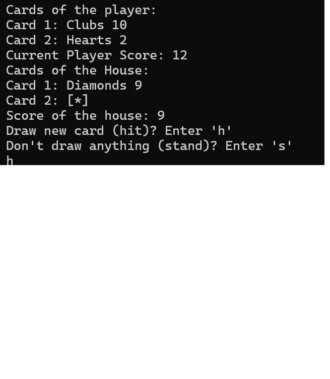

Do Programming Project 14.11 and extend the program to play blackjack, where
the computer plays the role of the house and one or more users play against the
house. The implementation reuses the `Card`, `Deck`, `Hand`, and input
validation utilities from project **14.11_Cards** and adds a `Game` class that
orchestrates the blackjack flow.

# Illustrative example

  

## Files and Responsibilities

- `14_12_Application.cpp` – contains `main`, which creates a `Game` object and
  calls `play()` to run a single round of blackjack.
- `14_12_Game.h/.cpp` – define and implement the `Game` class and all
  blackjack-specific logic.
- `14_11_Card.h/.cpp` – define a `Card` class with suit/rank, validation, and
  comparison/streaming operators.
- `14_11_Deck.h/.cpp` – define a `Deck` class that owns a dynamic array of
  `Card` objects, supports shuffling, dealing, adding, and printing cards.
- `14_11_Hand.h/.cpp` – define a `Hand` class that publicly derives from
  `Deck` and represents a set of cards held by a player or the dealer.
- `14_11_Validation.h/.cpp` – provide robust input helpers `readName` for
  reading strings and single characters from streams.

## Card / Deck / Hand Infrastructure (14.11_Cards)

These components are shared with the previous exercise and provide generic
card-handling capabilities that blackjack builds upon.

### Card

- `Card` stores:
  - `suit` – one of `"Clubs"`, `"Diamonds"`, `"Hearts"`, `"Spades"`.
  - `name` – one of `"Ace"`, `"2"`, `"3"`, `"4"`, `"5"`, `"6"`, `"7"`,
    `"8"`, `"9"`, `"10"`, `"Jack"`, `"Queen"`, `"King"`.
- Static arrays `SUITS` and `NAMES` in `14_11_Card.h` define the valid values
  and their ordering.
- `14_11_Card.cpp` provides:
  - Local helpers `validSuit` and `validName` to verify user input against the
    tables.
  - `indexOf` to locate a rank or suit index in `NAMES`/`SUITS`.
  - `Card::operator<` that orders cards first by rank (as indexed in `NAMES`)
    and, when ranks tie, by suit (as indexed in `SUITS`).
  - `Card::operator==` that compares both `suit` and `name`.
  - Stream extraction `operator>>` that prompts for a suit and rank, validates
    them with `validSuit`/`validName`, and sets the card members.
  - Stream insertion `operator<<` that prints `<suit> <name>` followed by a
    newline.

### Deck

- `Deck` owns a dynamic array of `Card` (`CardPtr deck`) and an integer
  `numberCards` that tracks how many elements are logically in the deck.
- Construction and lifetime:
  - Default constructor allocates `DECK_SIZE` (52) cards and fills them with
    all combinations of `SUITS` × `NAMES`, yielding a standard 52-card deck.
  - Copy constructor, assignment operator, and destructor implement the Rule
    of Three, performing deep copies and proper cleanup of the dynamic array.
- Operations:
  - `print(std::ostream&) const` prints each card as `"Card i: <card>"` by
    delegating to the `Card` insertion operator.
  - `sort()` performs a selection sort on the internal array using
    `Card::operator<` to order the cards by rank, then suit.
  - `shuffle()` implements Fisher–Yates shuffling using a `thread_local
    std::mt19937` RNG and `std::uniform_int_distribution` to randomly swap
    positions.
  - `add(const Card&)` grows the deck by allocating a new array of size
    `numberCards + 1`, copying existing cards, appending the new card, then
    replacing the old array.
  - `remove()` removes and returns the first card in the deck, shifting the
    remaining cards down by one in a newly allocated array (`numberCards`
    decreases by one).
  - `emptyDeck()` sets `numberCards` to zero (logical empty) without freeing
    storage.
  - `getNumberCards()` returns the logical size.
  - `operator const` returns a const reference to the card at the given
    index with bounds checking, throwing `std::out_of_range` on invalid
    indices.
  - Stream operators `operator<<` and `operator>>` print or read cards for a
    `Deck`. The extractor uses `Card::operator>>` and prevents duplicates by
    checking `operator==` before appending.

### Hand

- `Hand` publicly derives from `Deck` and represents the cards held by a
  player or the dealer.
- Its default constructor calls the `Deck` constructor to allocate storage and
  then calls `emptyDeck()` so that a hand starts with zero cards.
- Because `Hand` is a `Deck`, all deck operations (`add`, `remove`,
  `shuffle`, `sort`, `print`, `operator<<`, `operator[]`, etc.) are available
  for hands as well.

### Validation

- `14_11_Validation.h/.cpp` define two overloads of `readName` in
  `myNamespaceValidation`:
  - `readName(std::istream&, std::string&)` reads a whole line into a string
    with error recovery.
  - `readName(std::istream&, char&)` reads a single character with robust
    error handling and input flushing.
- These helpers are used in `Card::operator>>`, `Deck::operator>>`, and the
  blackjack `Game` class for safe console input.

## Blackjack Game Logic (14.12_Blackjack)

### Game Overview

The blackjack logic is encapsulated in the `myNamespaceBlackjack::Game`
class (`14_12_Game.h/.cpp`). The game uses:

- One `Deck shoe;` – the shuffled deck used to deal cards.
- An array `Hand hands[N_PLAYERS];` – index `0` is the dealer (house), and
  indices `1..N_PLAYERS-1` are players. The constant `N_PLAYERS` can be
  adjusted (default 3: 1 dealer + 2 players).

The game flow for a single round is:

1. Shuffle the deck and deal two cards to each player and the dealer.
2. Each player in turn takes a turn (hit/stand) while seeing one dealer card
   hidden.
3. If all players are bust, the round ends immediately with the house
   winning.
4. Otherwise, the dealer takes their turn, hitting until at least 17.
5. Finally, the program resolves each player’s outcome versus the dealer
   (win/lose/push), considering busts and blackjacks.

### Game::play()

- Called from `main` (`14_12_Application.cpp`) to execute a single round.
- For each player index `idx = 1..N_PLAYERS-1`, calls `playerTurn(hands[idx])`.
- After all player turns, checks whether all players (non-dealer) are bust. If
  so, prints `"The House wins"` and returns; the dealer does not play.
- If at least one player is still alive (not bust), calls `dealerTurn()`
  followed by `resolveRound()` to display and compare results.

### Dealing Initial Cards

`dealInitial()` distributes two cards to each participant:

- For two rounds (`CARDS = 2`):
  - Loops over players from last index down to 0 so that players are dealt
    first and the dealer last in each round.
  - Uses `shoe.remove()` to draw the top card from the deck and
    `hands[idxPlayer].add(newCard)` to add it to each hand.

After construction, the `Game` constructor shuffles the deck and calls
`dealInitial()`.

### Hand Values and Helper Functions

- `handValue(const Hand&) const` – returns the blackjack value of a full
  hand by delegating to the range helper below with all cards visible.
- `handValueHidden(const Hand&) const` – returns the value of all but the last
  card (used to show only the visible dealer card(s) while one remains
  hidden).
- `handValue(const Hand&, int visibleCards) const` – internal helper that
  computes the blackjack value of the first `visibleCards` cards:
  - `Ace` starts as 11 and increments an `aces` counter.
  - `10`, `Jack`, `Queen`, `King` count as 10.

  - If the total value exceeds 21, the hand is considered bust.
  - A hand with an Ace and a 10-value card (10, Jack, Queen, King) is a blackjack.
  - During a player's turn, they can choose to hit (take another card) or stand (end their turn).
  - The dealer must hit until their hand value is at least 17.
  - After all players have completed their turns, the results are resolved by comparing each player's hand against the dealer's.

