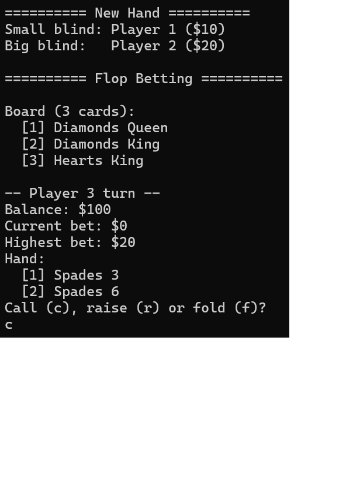

Do Programming Project 14.11 and extend the program to play five-card stud
poker between two hands. Add more functions as necessary to implement your
program. For an additional challenge, incorporate a betting component.

Note of implementation: I decided to implement Texas hold'em poker

---

# Illustrative example

  

## Project overview

This project extends the card engine from `14.11_Cards` into a playable
console Texas Hold'em game (`14.13_Poker`) with:

- multiple players
- blinds and betting rounds
- hand evaluation (Royal Flush down to High Card)
- winner resolution and tie handling
- player elimination when bankroll reaches 0

---

## Software architecture

The code is organized in two layers.

### 1) Card engine layer (`14.11_Cards`)

Reusable low-level card abstractions.

- `14_11_Card.h/.cpp`
  - Defines `Card` (`suit`, `name`), validation, and stream operators.
  - Supports comparison operators used by sorting/evaluation logic.

- `14_11_Deck.h/.cpp`
  - Dynamic array-based deck of `Card`.
  - Core operations: `shuffle`, `sort`, `add`, `remove`, `operator[]`, I/O.
  - Implements copy constructor/assignment for deep copy behavior.

- `14_11_Hand.h/.cpp`
  - `Hand` inherits from `Deck`.
  - Represents a card subset (player cards or best evaluated 5-card hand).

- `14_11_Validation.h/.cpp`
  - Input helpers (`readName`, `readNumber`) with retry loops and stream cleanup.

### 2) Poker game layer (`14.13_Poker`)

Texas Hold'em rules and flow built on top of the card layer.

- `14_13_Player.h/.cpp`
  - Represents one player state:
	- identity (`namePlayer`)
	- bankroll (`money`)
	- current round bet (`bet`)
	- folded flag (`folded`)
	- private cards (`hand`)
	- evaluated best hand (`bestHand`)
	- ranking (`ranking`)
  - Handles betting (`placeBet`), fold, turn reset, and payout reporting.

- `14_13_Game.h/.cpp`
  - Orchestrates full game lifecycle:
	- deck/shoe management
	- blinds rotation
	- betting rounds
	- community board cards
	- hand ranking and winner payment
	- elimination and next-hand state reset

- `14_13_Application.cpp`
  - Entry point (`main`) that creates players, creates `Game`, and calls `play()`.

---

## Runtime game flow

`Game::play()` runs hands in a loop until one player remains.

Per hand (`playHand` + helpers):

1. `initiateTurn()`
   - reshuffles/recreates deck if needed
   - resets each player's turn state
   - posts small and big blinds
   - deals 2 private cards per player
   - deals initial 3-card board (flop)

2. Betting rounds (`takeBets()`)
   - players choose `call`, `raise`, or `fold`
   - round can end early if only one active player remains

3. Board progression
   - after first betting: deal turn (4th board card)
   - after second betting: deal river (5th board card)

4. `resolveRound()`
   - evaluate each non-folded player
   - pick highest ranking
   - break ties with best-hand card comparison
   - pay winner(s)

5. `resetRoundState()`
   - clear pot/board
   - remove eliminated players
   - rotate blinds/current player

---

## Hand evaluation design

`Game::setRanking(...)` checks hands from strongest to weakest:

1. Royal Flush
2. Straight Flush
3. Four of a Kind
4. Full House
5. Flush
6. Straight
7. Three of a Kind
8. Two Pair
9. One Pair
10. High Card

Each detector:

- returns `true` when matched
- stores a canonical 5-card `bestHand` order in `Player`

Tie resolution (`payTieWinners`) compares stored `bestHand` cards in order via
`compareBestHands`, then:

- awards full pot to one best player, or
- splits pot equally among exact equals

---

## Design notes

- Namespaces separate concerns:
  - `myNamespaceCards` (card engine)
  - `myNamespacePoker` (game logic)
  - `myNamespaceValidation` (input)

- The current implementation is console-interactive and synchronous.

- The architecture is class-centric and stateful:
  - `Game` = session coordinator
  - `Player` = participant state model
  - `Deck/Hand/Card` = domain primitives

---

## Build/Tooling context

- Language standard: **C++23**
- Build system: **CMake** (minimum 3.10)
- Typical generator used here: **Ninja**

