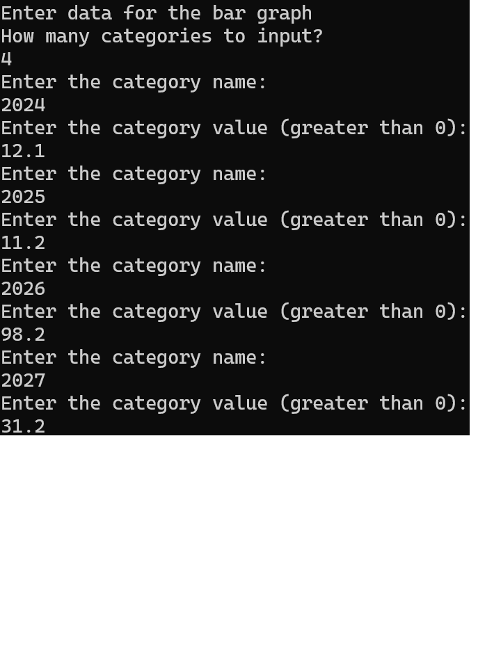

Flesh out Programming Problem 15.1. Give new definitions for the various constructors
and member functions, Graph::draw, Graph::erase, BarGraph::draw,
BarGraph::erase, LineGraph::draw, and LineGraph::erase so that the
draw functions actually draw figures on the screen by placing the character ‘*’
at suitable locations on the screen. For the erase functions, you can simply clear
the screen (by outputting blank lines or by doing something more sophisticated).
There are a lot of details in this and you will have to decide on some of them on
your own.

---

# Illustrative example

  

## Project Structure and Class Logic

### Code Structure
- **graph.h / graph.cpp**: Defines and implements the base class `Graph`.
- **bargraph.h / bargraph.cpp**: Defines and implements the derived class `BarGraph`.
- **linegraph.h / linegraph.cpp**: Defines and implements the derived class `LineGraph`.
- **main test file**: Uses the provided `main()` to create `BarGraph` and `LineGraph` objects and call `draw()` and `erase()`.

### Main Class Responsibilities
- **`Graph` (base class)**:
  - Provides shared interface for all graph types.
  - Declares `draw()` and `erase()` member functions.
  - In Part (a), these are non-virtual; in Part (b), they are virtual to enable runtime polymorphism.

- **`BarGraph` (derived class)**:
  - Overrides `draw()` with bar-graph behavior (stub output in 15.1, real drawing in 15.2).
  - Overrides `erase()` to clear/reset bar-graph output.

- **`LineGraph` (derived class)**:
  - Overrides `draw()` with line-graph behavior (stub output in 15.1, real drawing in 15.2).
  - Overrides `erase()` to clear/reset line-graph output.

### Testing Flow in `main()`
1. Construct a `BarGraph` object, call `draw()` and `erase()`.
2. Construct a `LineGraph` object, call `draw()` and `erase()`.
3. Compare behavior with non-virtual vs virtual functions to observe polymorphism effects.

