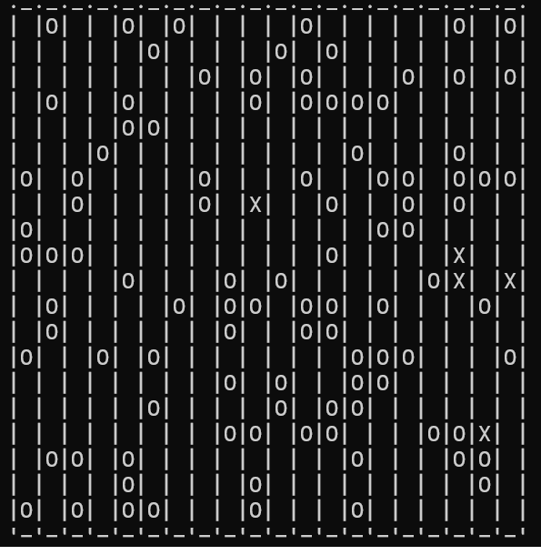

The goal for this programming project is to create a simple 2D predator–prey
simulation. In this simulation, the prey are ants and the predators are doodlebugs.
These critters live in a 20 * 20 grid of cells. Only one critter may occupy
a cell at a time. The grid is enclosed, so a critter is not allowed to move off the
edges of the world. Time is simulated in steps. Each critter performs some action
every time step.
The ants behave according to the following model:
- Move. For every time step, the ants randomly try to move up, down, left, or
right. If the neighboring cell in the selected direction is occupied or would
move the ant off the grid, then the ant stays in the current cell.
- Breed. If an ant survives for three time steps, at the end of the time step (i.e.,
after moving) the ant will breed. This is simulated by creating a new ant in an
adjacent (up, down, left, or right) cell that is empty. If there is no empty cell
available, no breeding occurs. Once an offspring is produced, an ant cannot
produce an offspring again until it has survived three more time steps.
The doodlebugs behave according to the following model:
- Move. For every time step, the doodlebug will move to an adjacent cell containing
an ant and eat the ant. If there are no ants in adjoining cells, the doodlebug
moves according to the same rules as the ant. Note that a doodlebug cannot eat
other doodlebugs.
- Breed. If a doodlebug survives for eight time steps, at the end of the time step it
will spawn off a new doodlebug in the same manner as the ant.
- Starve. If a doodlebug has not eaten an ant within three time steps, at the end
of the third time step it will starve and die. The doodlebug should then be removed
from the grid of cells.
During one turn, all the doodlebugs should move before the ants.
Write a program to implement this simulation and draw the world using ASCII
characters of “O” for an ant and “X” for a doodlebug. Create a class named
Organism
that encapsulates basic data common to ants and doodlebugs. This class
should have a virtual function named move that is defined in the derived classes
of Ant and Doodlebug. You may need additional data structures to keep track of
which critters have moved.
Initialize the world with 5 doodlebugs and 100 ants. After each time step, prompt
the user to press Enter to move to the next time step. You should see a cyclical pattern
between the population of predators and prey, although random perturbations
may lead to the elimination of one or both species.

---

# Illustrative example

  

## Code Structure and Logic

### Main Classes
- **World**: Owns the 20x20 board of pointers to `Organism` (either `Ant` or `Doodlebug`). Responsible for initializing, simulating turns, and managing the board.
- **Organism**: Abstract base class for all critters. Defines the interface for movement, reproduction, and shared state (position, breed timer, played flag).
- **Ant**: Inherits from `Organism`. Implements ant-specific movement and breeding logic.
- **Doodlebug**: Inherits from `Organism`. Implements doodlebug-specific movement, breeding, and starvation logic.

### Simulation Flow
- The simulation is driven by `main()` in `15_03_Application.cpp`, which repeatedly calls `World::next()` and `World::output()`.
- `World::next()` orchestrates a full turn:
    1. Resets all organisms' `played` flag.
    2. Calls `doodlebugsTurn()` (all doodlebugs move, eat, breed, and possibly starve).
    3. Calls `antsTurn()` (all ants move and breed).

### Function Call Relationships
- **World → Organism**: During each turn, `World` iterates over the board and calls `move(World&)` on each organism (polymorphic call).
- **Organism → World**: Inside `move(World&)`, the organism queries the world for possible moves:
    - Calls `World::freePositions(this)` to get empty adjacent cells.
    - Doodlebug calls `World::neighborAnts(this)` to find adjacent ants.
    - To move or eat, the organism calls `World::changePosition(this, newPosition)` or `World::eatAnt(this, newPosition)`.
- **Breeding**: After moving, if the organism's breed timer reaches zero, `World` calls `breed(Organism*)` to spawn a new organism in an adjacent free cell.
- **Starvation**: After moving, if a doodlebug's starvation counter reaches zero, `World` calls `die(Organism*)` to remove it from the board.

### Responsibilities
- **World**: Owns all organisms, manages board state, and enforces turn order. Handles all board mutations (moving, eating, breeding, dying).
- **Organism**: Decides its own movement and breeding logic, but delegates all board changes to `World`.
- **Ant/Doodlebug**: Implement their own movement and breeding rules by overriding `move(World&)` and `resetBreedTime()`.

### Example Turn (Doodlebug)
1. `World::doodlebugsTurn()` calls `move(*this)` on each doodlebug.
2. Doodlebug checks for adjacent ants using `World::neighborAnts(this)`.
3. If an ant is found, doodlebug calls `World::eatAnt(this, pos)` and resets starvation.
4. If no ant, doodlebug calls `World::freePositions(this)` and moves if possible, incrementing starvation.
5. After moving, if breed timer is zero, `World::breed(this)` is called.
6. If starvation counter is zero, `World::die(this)` is called.

### Example Turn (Ant)
1. `World::antsTurn()` calls `move(*this)` on each ant.
2. Ant calls `World::freePositions(this)` and moves if possible.
3. After moving, if breed timer is zero, `World::breed(this)` is called.

### Summary
- **World** controls the simulation and owns all data.
- **Organism** subclasses decide their own actions, but all board changes are performed by `World`.
- This separation ensures safe memory management and clear responsibility for each class.

