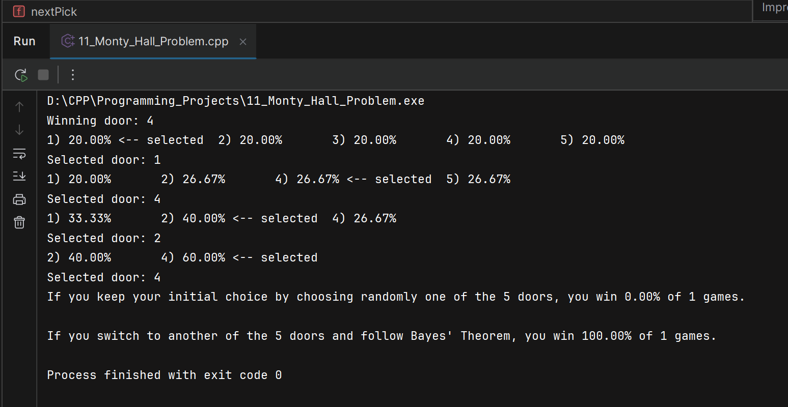
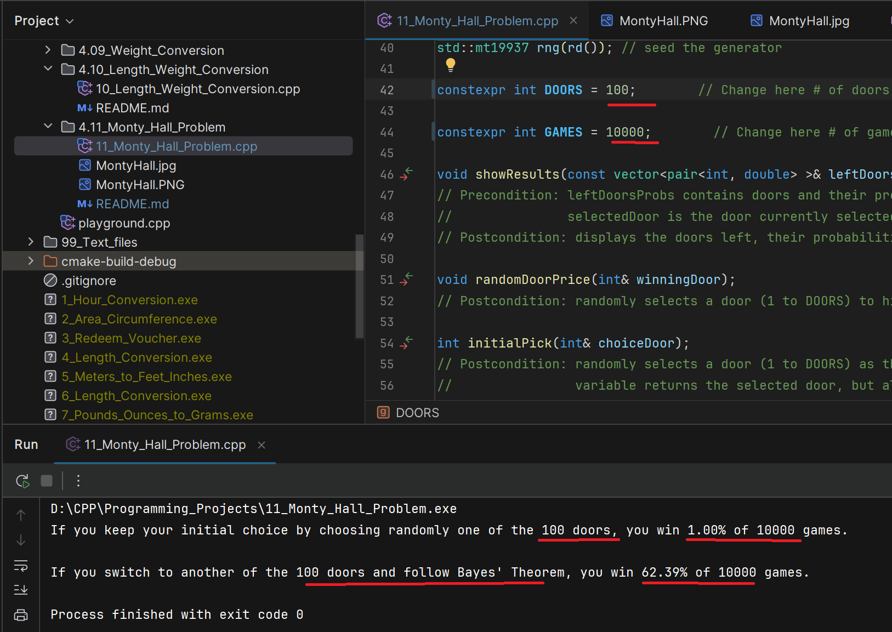
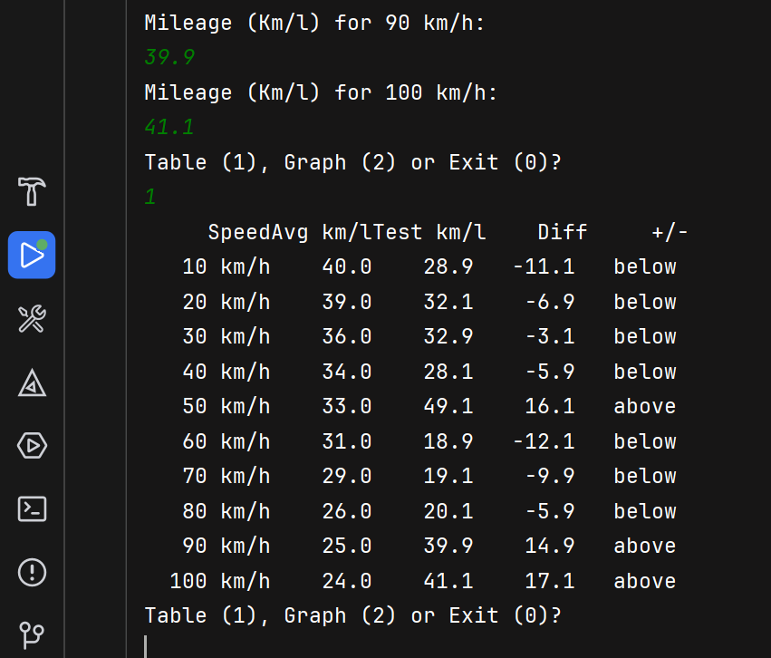
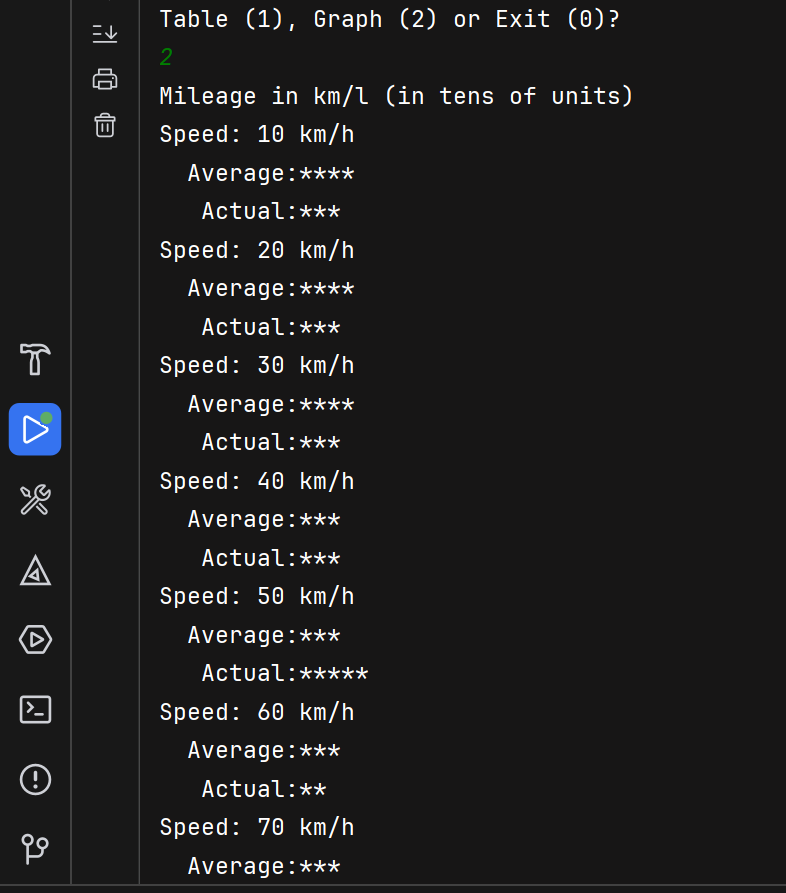
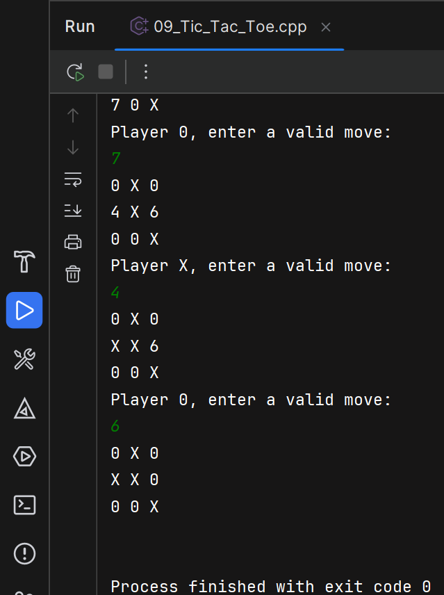
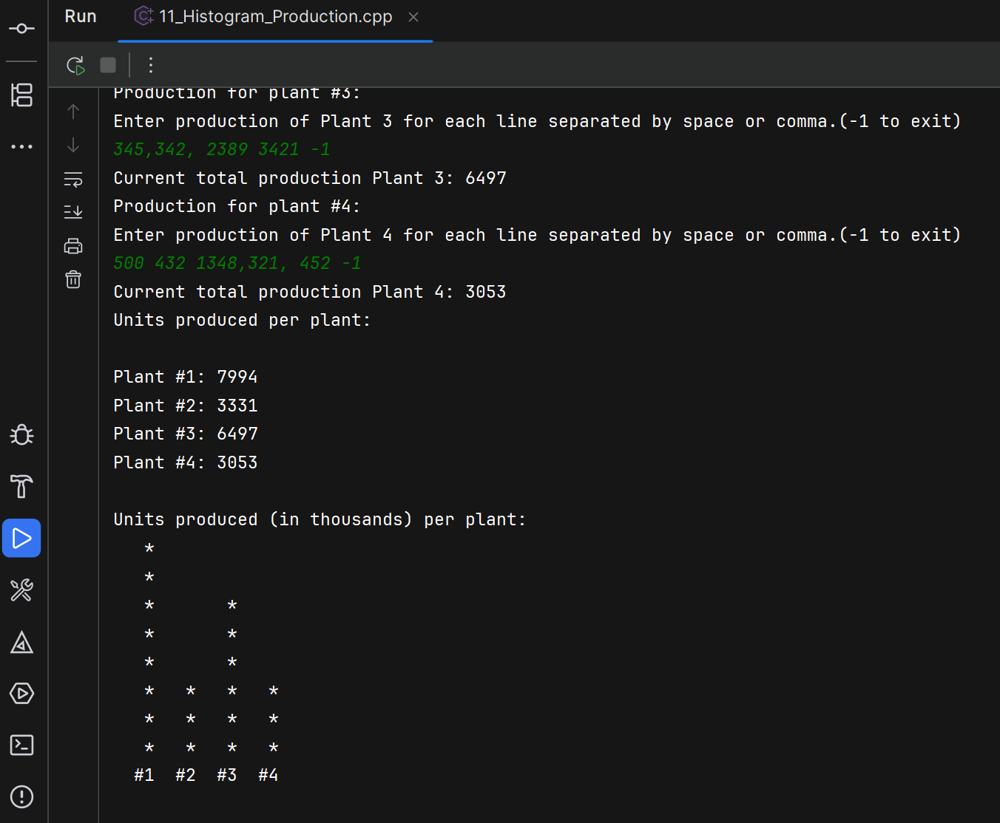
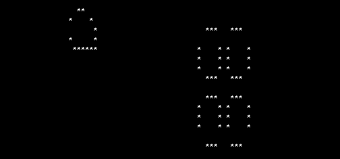
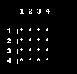
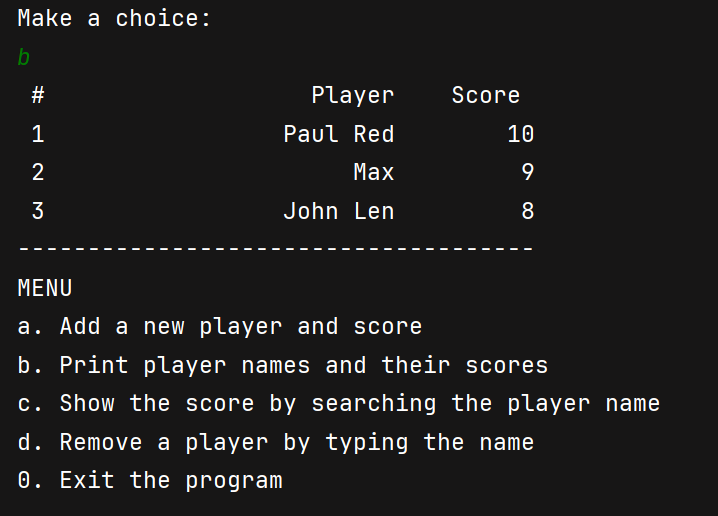

# Projects

# Practical C++ Problems

This repository contains practical, real-life programming problems solved in C++20 and above.
This README lists the documentation files for the collections: `01-Basics` - `06-OOP`
(much more to come related to memory management, pointers, etc. for a total of 20 sections). 
Check also my [Other projects](https://github.com/ersmax)

# Important notes
Setup: Visual Studio 2026 with C++20 or later standard, CMake 3.25 or higher.

## 1. Basics
Variables, Expressions, and Assignment Statements. 
Console Input/Output, Program Style, Libraries and Namespaces.

1. [Volume](01_Basics/01_Volume) \- Convert milliliters to gallons and compute number of packets needed.
2. [Diet](01_Basics/02_Diet) \- Estimate maximum safe diet soda consumption based on sweetener toxicity scaling.
3. [Sales Profit Increase](01_Basics/03_Sales_Profit_Increase) \- Calculate sales and profit increases given previous year's figures.
4. [Loan](01_Basics/04_Loan) \- Compute face value and monthly payment for a discount installment loan.
5. [Truck capacity](01_Basics/05_Truck_capacity) \- Determine if a truck is overloaded and how many boxes to add/remove.
6. [Cab fare](01_Basics/06_Cab_fare) \- Compute cab fare based on distance brackets and time charge.
7. [Calories deficit](01_Basics/07_Calories_deficit) \- Calculate calories burned during a staged treadmill workout.
8. [Babylonian algorithm](01_Basics/08_Babylonian_algorithm) \- Babylonian method to approximate square roots (5 iterations).
9. [Arcade prize](01_Basics/09_Arcade_prize) \- Redeem coupons for candy bars and gumballs with preference logic.
10. [Plane distance](01_Basics/10_Plane_distance) \- Compute airplane distance and convert speed to meters per second.
11. [Time](01_Basics/11_Time) \- Convert total seconds into hours, minutes, and seconds.
12. [BMI](01_Basics/12_BMI) \- Estimate ideal body weight based on height (5 feet baseline + 5 lb per inch).
13. [Coffee intake](01_Basics/13_Coffee_intake) \- Compute how many drinks reach a lethal caffeine dose estimate.

---

## 2. Flow of Control
Boolean Expressions, Branching Mechanisms, Loops, Introduction to File Input.

1. [Apartment price](02_Flow_of_Control/2.01_Apartment_price) \- Estimate apartment prices per floor including compound base price increases, amenities, and taxes.
2. [Interests deposit](02_Flow_of_Control/2.02_Interests_deposit) \- Calculate how many months a deposit lasts with monthly withdrawals and interest; includes boundary checks.
3. [Financing education](02_Flow_of_Control/2.03_Financing_education) \- Determine how many children a donor can sponsor and remaining amount.
4. [Prime numbers](02_Flow_of_Control/2.04_Prime_numbers) \- Print all prime numbers between 3 and 100 using an efficient divisor check.
5. [Cryptarithmetic puzzle](02_Flow_of_Control/2.05_Cryptarithmetic_puzzle) \- Solve TOO + TOO + TOO + TOO = GOOD by brute-force digit assignment with uniqueness checks.
6. [Buoyancy](02_Flow_of_Control/2.06_Buoyancy) \- Determine if a sphere floats or sinks in water using Archimedes' principle and sphere volume formula.
7. [GPA](02_Flow_of_Control/2.07_GPA) \- Compute grade point average from letter grades with validation and case-insensitive input handling.
8. [Equivalent Temperatures](02_Flow_of_Control/2.08_Equivalent_Temperatures) \- Find the integer temperature that is the same in Celsius and Fahrenheit.
9. [Babylonian cyclic](02_Flow_of_Control/2.09_Babylonian_cyclic) \- Babylonian algorithm to compute square root iteratively until within 1% of previous guess.
10. [Text replacement](02_Flow_of_Control/2.10_Text_replacement) \- Read a text file and replace occurrences of hate with love while printing words.
11. [Ideal BMI](02_Flow_of_Control/2.11_Ideal_BMI) \- Read names and heights from a file and compute ideal body weight for each entry.
12. [Benfords Law](02_Flow_of_Control/2.12_Benfords_Law) \- Analyze leading-digit distribution of numbers from a file to test Benford's Law.
13. [Pair sum](02_Flow_of_Control/2.13_Pair_sum) \- Check whether any pair from a file of 10 integers sums to a user-provided target.

---

## 3. Function Basics
Predefined functions, Programmer-defined functions, Scope rules.

1. [File size](03_Function/3.01_File_size) \- Compute video file size from bit rate and duration (megabyte = 8000 kilobits).
2. [Salary hike](03_Function/3.02_Salary_hike) \- Compute employee raise percentage and allow repeated calculations.
3. [Future salary_hike](03_Function/3.03_Future_salary_hike) \- Estimate future salaries and total future salary over N years.
4. [Gravitational force](03_Function/3.04_Gravitational_force) \- Compute gravitational force using global constant G.
5. [Clothing size](03_Function/3.05_Clothing_size) \- Compute hat, jacket, and waist sizes with age adjustments.
6. [Scores statistics](03_Function/3.06_Scores_statistics) \- Compute average and standard deviation of four scores.
7. [Euclidean distance](03_Function/3.07_Euclidean_distance) \- Compute distance between two points using the Euclidean formula.
8. [Bottles beer](03_Function/3.08_Bottles_beer) \- Print the Ninety-Nine Bottles of Beer song using words for numbers.
9. [Game of craps](03_Function/3.09_Game_of_craps) \- Simulate 10,000 games of craps (Pass Line) and compute the winning probability.
10. [Estimated height](03_Function/3.10_Estimated_height) \- Estimate the height of a child based on parents' heights and gender.
11. [Game of Pig](03_Function/3.11_Game_of_Pig) \- Two-player Pig game (human vs computer) based on turn-based die rolls.

    

12. [Day from date](03_Function/3.12_Day_from_date) \- Input a date (e\.g\., July 4 2008) 
    and output the corresponding day of the week using a table\-based algorithm 
    \([Wikipedia: Calculating the day of the week](http://en.wikipedia.org/wiki/Calculating_the_day_of_the_week)\)\. 
    Includes both map\-based and switch\-based implementations for month value lookup\.
13. [Price Winners Lottery](03_Function/3.13_Price_Winners_Lottery) 
    \- Randomly select Unique winners from Lottery finalists for identical prizes.  
    Uses the independent rule of selection without replacement.
    Includes two solution approaches: swap-and-shrink pool and boolean flag array to ensure no duplicate winners.
14. [Babylonian square root](03_Function/3.14_Babylonian_square_root) 
    \- Compute the square root of a positive number using the Babylonian algorithm until convergence within 
    1% of the previous guess. Use functions and input validation with several numbers, including error handling 
    for negative inputs.
15. [Likelihood of Death](03_Function/3.15_Likelihood_death) 
    \- Simulate the age at which a person will die in the USA using an Actuarial Life table provided by 
    the Social Security Administration for the 2025. 
    Input: starting `age` and `gender` (`M`/`F`). Output: simulated age of death (stops at `MAX_AGE` = 120). 
    [Data File](03_Function/3.15_Likelihood_death/likelihood_death_2025.txt) available at
    the [Social Security Administration website](https://www.ssa.gov/OACT/STATS/table4c6.html).

---

## 4. Parameters and Overloading
Parameters, Overloading and Defaults Arguments, Testing and Debugging Functions.

1. [Hour Conversion](04_Parameters_Overloading/4.01_Hour_Conversion) 
   \- Convert 12-hour time format to 24-hour format with input validation.
   Check preconditions and proper input format (e.g., "02:30 PM") and insertion.
2. [Area Circumference](04_Parameters_Overloading/4.02_Area_Circumference) 
   \- Calculate area and circumference of a circle given its radius.
   Validate that the radius is a positive number before performing calculations.
3. [Redeem Voucher](04_Parameters_Overloading/4.03_Redeem_Voucher) 
   \- Redeem a voucher code for a discount on a purchase.
   Validate the voucher code against a predefined list and ensure the purchase amount is positive.
   Coded sorting and searching algorithms for voucher codes as well as input validation with `vector<pair>`.
4. [Feet Inches to Meters](04_Parameters_Overloading/4.04_Feet_Inches_to_Meters) 
   \- Convert lengths between different units (e.g., inches to centimeters).
   Validate that the input length is a non-negative number and that the specified units are supported.
5. [Meters to Feet Inches](04_Parameters_Overloading/4.05_Meters_to_Feet_Inches) 
   \- Convert lengths from meters and centimeters to feet and inches.
   Validate that meters are in [0, 2] and centimeters in [0, 99], truncating results to avoid rounding up.
6. [Length Conversion](04_Parameters_Overloading/4.06_Length_Conversion) 
   \- Combine conversions between feet\+inches and meters\+centimeters.
   Present a menu for conversion direction, validate inputs, and allow repeated conversions until exit.
   Add structures for Feet/Inches and Meters/cm to handle properly function overloading and modularity.
7. [Pounds Ounces to Grams](04_Parameters_Overloading/4.07_Pounds_Ounces_to_Grams) 
   \- Convert weights from pounds and ounces to kilograms and grams, allowing repeated conversions until exit.
8. [Grams to Pounds Ounces](04_Parameters_Overloading/4.08_Grams_to_Pounds_Ounces) 
   \- Convert weights from grams to pounds and ounces, allowing repeated conversions until exit.
9. [Weight Conversion](04_Parameters_Overloading/4.09_Weight_Conversion) 
   \- Combine conversions between pounds\+ounces and kilograms\+grams.
   Present a menu for conversion direction, validate inputs, and allow repeated conversions until exit.
   Add structures for Pounds/Ounces and Kilograms/Grams to handle properly function overloading and modularity.
10. [Length and Weight Conversion](04_Parameters_Overloading/4.10_Length_Weight_Conversion) 
    \- Combine length and weight conversions into a single program with a menu and sub-menu, according to 
    the user's choice.
    Allow users to choose between length and weight conversions, validate inputs, and repeat until exit.
    Used function overloading, pass by reference and constant reference parameters. 
11. [Monty Hall Problem](./04_Parameters_Overloading/4.11_Monty_Hall_Problem)
    \- Simulate a generalized Monty Hall experiment to compare empirical win rates for the two strategies: staying with the initial pick versus switching after the host reveals losing doors.  
    - Configurable parameters: number of doors (`DOORS`) and number of simulations (`GAMES`) so you can test small and large-scale scenarios (e.g., `DOORS = 100`, `GAMES = 10000`).  
    - Supports the canonical host rule (host opens `n-2` losing doors, leaving exactly one other) and easily adapts to variants where the host leaves multiple unopened doors.  
    - Written in modern C++ using `std::vector`, iterators, `std::mt19937` and `std::uniform_int_distribution` for unbiased draws and reproducible results (seedable).  
    - Output: counts and percentages for wins when staying vs. switching; optional verbose mode for single-run tracing.  
    - Empirical results: For 10,000 runs and 100 doors, the simulation converges to 60% probability of success.
        

            
            
        

12. [Three Way Duel](./04_Parameters_Overloading/4.12_Three_Way_Duel)
    \- Simulate a three-way duel (truel) between three marksmen with different accuracies, under different strategies 
       (aiming at the strongest opponent, intentionally missing).
    - Written in modern C++ using `std::vector`, RNG`std::mt19937`, `bernoulli_distribution`.
    - The theory suggests 36.1% and 41.7% chances of success under 2 strategies. These results are validated through simulation.
        

            
        

13. [Treadmill Pace](./04_Parameters_Overloading/4.13_Treadmill_Pace)
    \- Convert a running pace and speed with input validation to demonstrates overloaded functions.
14. [Time Difference](./04_Parameters_Overloading/4.14_Time_Difference)
    \- Compute the number of minutes to advance a time\-machine from a start time to an end time using 24\-hour HHMM notation. 
      Input validation to ensure times are in the range 0000 to 2359 and minutes are valid (00 to 59).
15. [Convert Lowest Terms](./04_Parameters_Overloading/4.15_Convert_Lowest_Terms)
    \- Convert a fraction to its lowest terms using the greatest common divisor (GCD) algorithms, that is Prime factorization and Euclidean algorithm.
      Input validation to ensure denominator is not zero and both numerator and denominator are integers.
16. [Highest Score](./04_Parameters_Overloading/4.16_Highest_Score)
    \- Read names and scores from a file, determine the highest score, and print the highest score and relative name.
      Input validation to ensure scores are non-negative integers and handle file reading errors.
17. [Get Player score and avg comparison](./04_Parameters_Overloading/4.17_Get_Score_Average_Score)
    \- Read player names and scores from a file, query the score of a player and compare it with the average.
      Input validation to handle file reading errors.
18. [Sorting Quicksort](./04_Parameters_Overloading/4.18_Sorting_Trivial_Quick_Merge)
    \- Implement the Quicksort algorithm (by reference and by value or copy) to sort an array of integers and apply Hoare's algorithm.

---

## 5. Arrays
Introduction to Arrays, Arrays in functions, Programming with Arrays, Multidimensional Arrays.

1. [Car Mileage Visualization](05_Arrays/5.01_Graph_Car_Mileage)
   \- Compare a car's average mileage at different speeds with actual mileage values, and prints 
      a formatted comparison table and an ASCII graph.
   

     
     
   

2. [Remove duplicates](05_Arrays/5.02_Delete_Repeated_Characters) 
   \- Remove repeated letters from a partially filled array in-place using a three-pointer compaction 
   (p1/p2/p3); preserves first occurrences and order; O(n^2) time, O(1) extra space.
3. [Standard Deviation](05_Arrays/5.03_Standard_Deviation) 
   \-  Compute the population standard deviation for up to 10 double values 
    using a partially filled array; demonstrates input validation with std::stod, basic error handling, 
    and std::span for concise output.
4. [Count vowels](05_Arrays/5.04_Vowels_Count) 
   \- Count vowels in a user-input string using a fixed-size char array; demonstrates input validation, 
   character classification with std::isalpha and std::tolower, and array traversal. Explore alternatives with maps/sets.
5. [Integer Overflow Sum with Arrays](05_Arrays/5.05_Integer_Overflow_Sum_With_Arrays) 
   \- Sum two large integers represented as arrays of digits to avoid overflow; demonstrates array manipulation, 
   carry handling, and formatted output.
6. [Contest Score](05_Arrays/5.06_Contest_Score) \- Read validated scores (1..10) from judges across 
   a number of categories, compute per-judge averages, per-parameter averages and a final participant average, 
   and print a formatted results table. Implementation uses a fixed-size 2D C-style array and modular functions 
   with input validation and clear terminal prompts.
7. [Histogram Grades](05_Arrays/5.07_Histogram_Grades) \- Gather validated quiz grades, 
   count frequencies in an array, and print a text histogram; supports early termination and rejects malformed input.
8. [Birthday Paradox](05_Arrays/5.08_Birthday_Paradox)  \- This program simulates the birthday paradox 
   over many trials (default 5000). Use <random> library, checks pairwise for any matching birthdays, and prints probabilities.
   Make use of operator overloading for structure comparison and static RNG for efficiency.
9. [Tic Tac Toe](05_Arrays/5.09_Tic_Tac_Toe) \- Two-player Tic Tac Toe game using a 3x3 char array board.
   Players alternate turns, input validation ensures valid and not repeated moves. The board is displayed after each move for clarity.
   Use enum to keep track of player turn, and function modularity for clarity.
   

     
   

10. [Ice Cream Parlor](05_Arrays/5.10_Ice_Cream_Parlor) \- This program helps customers select ice cream flavors
    based on their preferences. It lists flavors with numeric codes and stock, accepts repeated code quantity purchases, 
    updates inventory immediately, records purchases per flavor in a cart, and prints remaining stock and the cart on exit.
11. [Histogram Production](05_Arrays/5.11_Histogram_Production) \- This program reads daily production for  different plants of a factory, 
    counts frequencies in specified ranges using a fixed-size array, and prints a text histogram.
    It includes input validation for numeric entries and handles file reading errors.
    

      
    

12. [Game of Life](05_Arrays/5.12_Game_of_Life) \- This implementation of Conway's Game of Life uses an 80×22 char grid.
    Two games are provided as stucture: a ship that collides into a pulsar and generate a new universe,
    and a shooting gun that produces butterflies. `struct` (`GliderGun` and `PulsarWithShip`) expose a static `apply(...)` method that places live-cell offsets,
    with an enum working as a dispatcher to select which pattern to apply at program start. This allows extendibility for new patterns in the future.
    mall helper actions inside the `generation` function are implemented as lambdas so they can capture local state
    (e.g., the counter for new living cells, `newBorn`). Grids are initialized efficiently with `std::fill_n`,
    the next generation is computed into a separate `nextGenGrid` and then applied in one step with `std::memcpy`
    (births and deaths occur simultaneously at generation boundaries), and `std::this_thread::sleep_for` together with `std::chrono::milliseconds`
    is used to pause between visualizations.
    

      
      
    

13. [Memory Matching Game](05_Arrays/5.13_Memory_Matching_Cards) 
    \- This program implements a console-based Memory Matching Game using a 4x4 grid of cards.
    The player flips two cards per turn by entering row/column coordinates; matching pairs remain revealed. 
    Includes input validation to prevent invalid or repeated selections, 
    a Fisher\-Yates shuffle for unbiased random placement. 
    The board is redrawn after each turn and the game announces victory when all pairs are found.
    

      
    

14. [Movie Recommender](05_Arrays/5.14_Movie_Recommendation) 
    \- This program recommends movies based on user preferences using a fixed-size 2D array of ratings.
    It prompts the user for their ratings on a scale of 1 to 5 for a set of predefined movies, validates input,
    computes average ratings per movie, and suggests the highest-rated movie that the user hasn't rated yet.
    Input validation ensures ratings are numeric and within the valid range.
15. [Randomized Challenge Response System](05_Arrays/5.15_Randomized_Challenge_Response_System) 
    \- Implements a randomized challenge/response PIN verification.
    The program builds a random mapping from digits 0..9 to values 1..NUMBERS, 
    displays the mapping to the user, prompts the user to enter the mapped sequence corresponding 
    to the stored PIN, and verifies the response by mapping each stored PIN digit 
    through the table and comparing to the user input.
    Make use of integer to array mapping, random number generation with `<random>`, 
    and input validation to ensure correct digit entry.
16. [Movie Recommender from File](05_Arrays/5.16_Movie_Recommender_From_File) 
    \- This program recommends movie ratings based on user preferences on movies he had seen, starting from a file of reviewer ratings.
    Reads reviewer ratings from a whitespace-delimited file (header + rows) using dedicated functions,
    populate a fixed‑capacity reviews array and the runtime reviewer count people (capped at 1000). 
    Prompts the user to rate a subset of movies (rated from 1.0 to 5.0) with input validation, 
    computes similarity amongst users with Euclidean‑distance to find the most similar reviewers, 
    averages their ratings to predict scores for unseen movies, and displays the top recommendations. 
    File read errors and malformed lines are handled properly.
    

      
    

17. [Benford Law Arrays](05_Arrays/5.17_Benford_Law_Arrays) 
    \- This program analyzes the leading-digit distribution of numbers from a file to test Benford's Law using arrays.
    It reads numbers from a specified file into a fixed-size array, extracts the leading digit of each number,
    counts the frequency of each leading digit using an array, and then compares the observed frequencies
    to the expected Benford's Law distribution, printing both for comparison.
    Input validation ensures that only positive numbers are processed, and file reading errors are handled properly.
    Two alternative of getting the leading digit are provided: using division and using string conversion.
18. [Highest Score with Merge Sort and avoid memory churn](05_Arrays/5.18_Highest_Score_Players) 
    \- This program reads names and scores from a file, sorts the entries using Merge Sort to find the highest score,
    and prints the highest score along with the corresponding name. 
    It uses a fixed-size array of structures to store names and scores, implements Merge Sort to sort the array,
    and includes input validation to handle file reading errors.
    The Merge Sort implementation is optimized to avoid excessive memory allocation by reusing a single auxiliary array
    for merging during the sort process.
19. [Players Statistics](05_Arrays/5.19_Players_Stats) 
    \- This program allows the user to icheck the list of players and their score, remove and add new players, check
    if a player exists. It uses a fixed-size array of structures to store player data, and includes input validation 
    to handle file reading errors. It also validates user input by trimming whitespace and ensuring non-empty names.
    

      
    

---

## 6. Structures and Classes
Structures, Classes.

1. [Employee Rating](06_Structures_Classes/6.01_Employee_Rating) 
   \- This program collects three component scores from the user, validates them, and computes a normalized total score and rating.
   The program defines a `Skills` structure to hold the component scores and uses functions to set skills, normalize scores, rate employees, and print results.
2. [Circle Class](06_Structures_Classes/6.02_Circle_Class) 
   \- This program defines a `Circle` class that encapsulates the properties and behaviors of a circle.
   It includes member variables for radius, diameter, area, and circumference, along with methods to set the radius,
   compute derived values, retrieve the radius, and display results. The program demonstrates the use of the class
   by creating an instance, setting its radius, and displaying the computed properties.
3. [Pair template implementation](06_Structures_Classes/6.03_Pair_Template_Implementation) 
   \- This program defines a `Point` class to represent a point in a 2D plane and implement the class `Pair` template.
   It includes member functions to set coordinates, move the point, rotate it 90 degrees clockwise,
   and retrieve the current coordinates. The program allows the user to input multiple points,
   displays their coordinates, rotates them, moves them by specified offsets, and shows the updated coordinates.